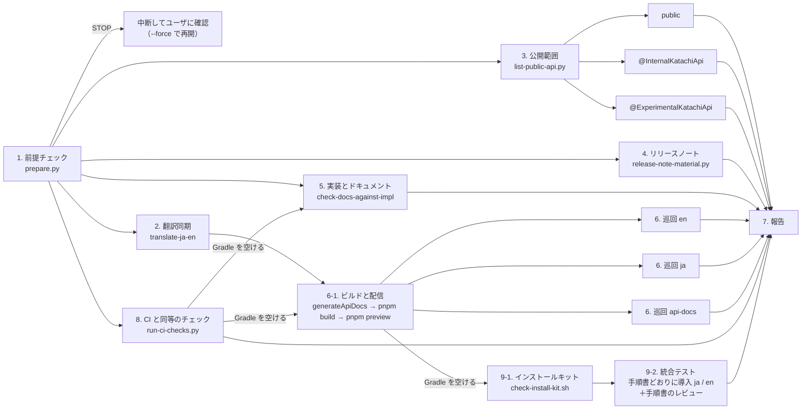

- @./prerelease-check-list.md を .local/release-v0.0.0/prerelease-check-list.md にコピーし適宜記載していく。
    - コピーは「1. 前提チェック」の `prepare.py` が、版の欄を埋めて行う（既にあれば上書きしない）。
    - 警告すべきことがあれば memo の details tag 内に記載する。警告すべきことがないのなら雑な警告は出さないように心がける。
- 並列な subagent に以下のタスクを任せる。prerelease-check-list.md は subagent ではなくオーケストレータであるあなたが記入する。
    - subagent は終了時の報告内容に警告内容を含めさせるようにする。
- 警告は以下の形式で報告する。
    ```md
    ### [WARN / priority 10/10] {警告内容タイトル}

    {警告内容詳細}
    ```
- 手順ごとの詳細は `references/` にある。手順を始める前に（subagent に任せるなら、その subagent に）該当のファイルを読ませる。



- 1 が通ったら、2・3・4・8 を並列に始める。3 と 6 の中は、区分ごとの subagent をさらに並列にする。
- 8 は Gradle を長く使う（10〜20 分）。5 のサンプルを動かす作業と 6-1 は、8 が終わってから始める。
- 9 も Gradle を長く使う（15〜20 分）。6-1 の `generateApiDocs` が終わってから始める（巡回を先に始めたいので 6-1 を先にする）。
  5 のサンプルを動かす作業とは、どちらかが終わるのを待って重ねない。
- 6 は 2 を待つ。英語のページを訳し直してからビルドしないと、古い英語を巡回することになる。
- 5 は日本語の原本だけを見るので、2 を待たない。3・4・5 はどれもファイルを書き換えないので、互いに待たない。
- **Gradle を使う作業は同時に1つだけ。**8、9、5 がサンプルを動かす作業、6-1 の `generateApiDocs` は互いに重ねない（同じ
  `katachi/build/` を取り合う。9 の `publishToMavenLocal` もリポジトリのビルド）。走らせる前に `pgrep -fl GradleWrapperMain` で確かめる。
- 7 は、ほかの全部が返ってから。チェックリストは各 subagent が返るたびにオーケストレータが書く。

## 作業場所の置き方

`.local/release-v<版>/` の直下には**人が読む成果物だけ**を置く。

| 直下に置くもの                   | 書く手順 |
|----------------------------------|----------|
| `prerelease-check-list.md`       | 1（写す）・オーケストレータ |
| `visibility-check.md`            | 3        |
| `release-note.md`                | 4        |
| `docs-vs-impl.md`                | 5        |
| `site-crawl.md`・`screenshots/`  | 6        |
| `ci-checks.md`                   | 8        |
| `install-kit.md`                 | 9-1      |
| `install-e2e.md`                 | 9-2      |
| `TODO.html`                      | 途中から・オーケストレータ（利用者がやること・決めることだけ） |
| `index.html`                     | 7（結果をひとまとめにしたもの） |

ログ・材料・中間ファイルはすべて `.local/release-v<版>/tmp/` の下に置く。例: `tmp/release-note-material.txt`、
`tmp/ci-checks/`（コマンドごとのログ）、`tmp/install-kit/`（fixture とログ）、`tmp/pages-<区分>.txt`、`tmp/crawl/`
（巡回の生データ）、`tmp/logs/`（pnpm や gradle のログ）、`tmp/visibility-<区分>.md`（区分ごとの一覧）、subagent の
`part-*.md` などの下書き。subagent に任せるときも、この置き場所を渡す。

## 1. 前提チェック

`prepare.py` で今回の版と公開済みの直前の版を比べ、上がっていなければ `STOP` で止まる（ユーザに確認し、`--force` で再開）。
通れば `.local/release-v<版>/` を作ってチェックリストを写す。以降の `<基準>` は出力の「基準（直前のタグ）」。
詳細: [references/prepare.md](references/prepare.md)

## 2. 日本語ドキュメントを 英語ドキュメントへ翻訳同期する

- translate-ja-en skill を実行する。

## 3. 公開範囲（可視性）のチェック

`list-public-api.py` で公開 API を3区分（public / `@InternalKatachiApi` / `@ExperimentalKatachiApi`）に全件列挙し、
区分ごとの subagent に妥当かを判断させる（直させない）。結果は `visibility-check.md`。
詳細: [references/visibility.md](references/visibility.md)

## 4. リリースノート作成

`release-note-material.py` で直前のタグからのコミットを材料に出し（`tmp/` へ）、利用者への影響を中心に `release-note.md` を書く。
詳細: [references/release-note.md](references/release-note.md)

## 5. 実際の実装・挙動 と ドキュメント に不整合がないかチェック

check-docs-against-impl skill を直前のタグを基準に走らせ、結果を `docs-vs-impl.md` にまとめさせる。
詳細: [references/docs-vs-impl.md](references/docs-vs-impl.md)

## 6. ドキュメントサイトと API リファレンスを Playwright で巡回する

`generateApiDocs` → `pnpm run build` → `pnpm preview` で配信し（6-1）、区分（en / ja / api-docs）ごとの subagent に
Playwright で全ページを巡回させる（直させない）。結果は `site-crawl.md` と `screenshots/`。
詳細: [references/site-crawl.md](references/site-crawl.md)

## 8. CI と同等のチェック

`run-ci-checks.py` で ci.yml の `run:` を手元で順に走らせる。オーケストレータが自分で走らせてよい。1つでも落ちたら
priority 10 の警告。結果は `ci-checks.md`、ログは `tmp/ci-checks/`。
詳細: [references/ci-checks.md](references/ci-checks.md)

## 9. インストールキットのチェック

- 9-1: `check-install-kit.sh` で `docs/public/install/katachi-install.sh` を合成の Gradle プロジェクト（fixture）で動かし、
  init → scaffold → `:architecture-test:test` が「Unexpected だけで落ちる」（配線は正しい）かを確かめる。
  オーケストレータが自分で走らせてよい。1つでも NG なら priority 10 の警告。結果は `install-kit.md`、fixture とログは `tmp/install-kit/`。
- 9-2: 統合テスト。subagent（opus）が AI エージェントとして手順書（ja / en）どおりに実在のプロジェクトの写しへ最後まで導入し、
  もう1体が手順書・スクリプト・チェックリストの食い違いを読んで確かめる。**手順書が適切か**を見る。結果は `install-e2e.md`。
  6-1 の配信を配信元に使うので、9-2 が終わるまで配信を止めない。

詳細: [references/install-kit.md](references/install-kit.md)

## 7. 報告

- **`TODO.html` は 7 を待たずに作り、状況が変わるたびに更新する**（subagent が返るたび・利用者が答えるたび）。
  利用者の手が要るもの（直すか決める / 判断 / 目を通す / 操作）だけを並べる。7 の直前に、結果をひとまとめにした
  `index.html` を作る。どちらも `.local/release-v<版>/` の直下。詳細: [references/report-html.md](references/report-html.md)
- それぞれの実行結果を
- 上記のステップを実行してきた中で見つけた警告をサマライズし重要なものがあればユーザに警告する。
- 形式は以下。この形式から外れないように厳密に処理する。
  ```
  ✅ リリース前チェック完了

  - 結果: file://{index.html の絶対パス}
  - TODO: file://{TODO.html の絶対パス}（{n} 件）
  - チェックリスト: file://{prerelease-check-list.md の絶対パス}
  - リリースノート: file://{.local/release-v0.0.0/release-note.md の絶対パス}
  
  ---
  
  ## リリースノート概要
  
  {file://{.local/release-v0.0.0/release-note.md をサマライズして 100 文字/文, 標準3文(最大でも5文) 以内にした内容}

  ---

  ## ⚠️ 重要な警告 {重要な警告がない場合はセクションごとトルツメ}

  ### {警告内容タイトル}

  {詳細}

  ---

  ## 軽微な警告

  - xx 件
  - 詳細: file://{prerelease-check-list.md の絶対パス}

  ---
  ```

    - 重要な警告がある場合は `✅ リリース前チェック完了` -> `⚠️ リリース前チェック完了` にする。
    - 重要な警告の詳細はダラダラ書きすぎない。
