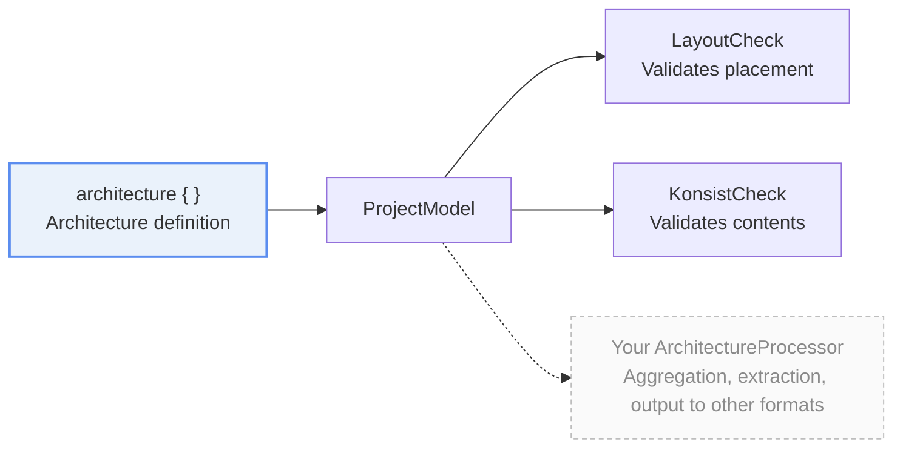

import { Aside, Tabs, TabItem } from "@astrojs/starlight/components"

## What is ArchitectureProcessor

katachi's `ArchitectureProcessor` is an interface that does something based on an architecture definition.

```kt
public interface ArchitectureProcessor<out R> {
    public fun process(model: ProjectModel): R
}
```

## katachi's two elements

Broadly speaking, katachi consists of two elements: the **architecture definition** and **ArchitectureProcessor**.



The definition itself doesn't execute anything. **It's `ArchitectureProcessor` that takes a `ProjectModel` and does something with it** — there's no distinction between the ones katachi bundles and the ones you write.

The architecture definition is the definition of your project's architecture, written inside an `architecture { }` block.

Defining an architecture by itself doesn't do anything. It's ArchitectureProcessor that uses it to do something.

## Built-in ArchitectureProcessors

katachi ships with three ArchitectureProcessors by default.

| Processor | What it does | Documentation |
| --- | --- | --- |
| `projectArchitecture.assert()` (`LayoutCheck`) | Validates whether files are placed according to the architecture definition, and throws an assertion exception if there are errors. |  |
| `GenerateDocumentation` | Generates documentation from properties such as summary and description written in the project definition. | |
| `GenerateCodeFromTemplate` | Generates files based on the contents of `template { }` blocks in the project definition. | |

Each of them takes the project's architecture definition and puts it to use generating something.

## Running an ArchitectureProcessor

There are a few patterns for running an ArchitectureProcessor.

The recommended way to run it differs per ArchitectureProcessor, so refer to each ArchitectureProcessor's own documentation for how to run it.

### Method 1. Call a provided API from your program

If an API is provided alongside the ArchitectureProcessor (often a top-level function), you can run the ArchitectureProcessor by calling that API.

For example, for LayoutCheck, you can run that ArchitectureProcessor by calling `projectArchitecture.assert()`.

```kt
projectArchitecture.assert() // Internally calls LayoutCheck().process(...)
```

### Method 2. Run it from the command line

The katachi Gradle plugin provides a `runKatachiProcessor` Gradle task for running an ArchitectureProcessor.

```shell
# Example: running GenerateCodeFromTemplate

# Run the runKatachiProcessor task
./gradlew runKatachiProcessor \
  # Specify the factory of the ArchitectureProcessor you want to run as the entrypoint
  --entrypoint='me.tbsten.katachi.template.GenerateCodeFromTemplate$FromArgs' \
  # Use -P to pass arguments to the ArchitectureProcessor
  -Prole='UseCase' -Pname='GetItemList' -PinvokeImpl='TODO()' // ...
```

## Custom ArchitectureProcessors

Because ArchitectureProcessor is provided as a simple interface, you can implement your own and freely add processing.

### 1. Implement ArchitectureProcessor

Prepare a class that implements ArchitectureProcessor and implement the `process` method.

```kt
class MyProcessor : ArchitectureProcessor<MyResult> {
    override fun process(model: ProjectModel): MyResult {
        // model.roles           -> the list of declared Roles
        // model.groups          -> the list of groups
        // model.declaredEntries -> the flattened list of declarations from layout { }
        // model.filesOf(role)   -> the paths of the files that Role actually has
        return model.roles.associate { it.qualifiedName to model.filesOf(it).size }
    }
}
```

`ProjectModel` hands you only these four things. **You never touch the architecture definition itself or the file system.** Only the results of the walk are passed in, so a processor never needs to go read files itself.

You decide the return type yourself. For a processor that has only side effects and returns no value, you can use `ArchitectureProcessorUnit` (an alias for `ArchitectureProcessor<Unit>`).

<details>
<summary>When you need a custom property on the architecture definition</summary>

Sometimes the user of an ArchitectureProcessor needs a custom property specified on the architecture definition.
In that case, you can use a Role's `metadata`.

For example, say you want to mark a Role that's already deprecated but still hangs around as legacy code. You can define and set a `Deprecated` metadata key as follows.

```kt {1-2, 8-9, 17} nocollapse
val Deprecated = metadata<Boolean>() // the metadata key
var MetadataScope.deprecated: Boolean? by Deprecated

// Processor side
class MyProcessor : ArchitectureProcessor<Unit> {
   override fun process(model: ProjectModel) {
      for (role in model.roles) {
         // Get the metadata value with Role[the metadata key]
         val deprecated: Boolean? = role[Deprecated]
      }
   }
}

// Usage side
architecture {
   "UseCase" {
      deprecated = true
   }
}
```

</details>

### 2. Provide a way to run ArchitectureProcessor

Provide a way for users to run your ArchitectureProcessor.

If you want it runnable from a program as an API, providing an API is recommended; if you want to run it as a one-shot, running it from the command line is recommended.

<Tabs>
    <TabItem label="Provide an API">

        Add a single extension function on `Architecture`. This is the same shape katachi uses to provide `assert()`.

        ```kt
        // Place this in the same file as MyProcessor
        @OptIn(ExperimentalKatachiApi::class)
        fun Architecture.countFiles(): MyResult = process(MyProcessor())
        ```

        Users don't even need to know the processor exists.

        ```kt
        val counts = projectArchitecture.countFiles()
        ```

    </TabItem>
    <TabItem label="Run it from a Gradle task">

        To accept arguments, **provide an entry point separate from the processing itself**.

        ```kt
        class MyProcessor : ArchitectureProcessor<MyResult> {
            override fun process(model: ProjectModel): MyResult {
                // ...
            }

            // Builds a MyProcessor from arguments. This is what the Gradle task calls
            object FromArgs : (Map<String, String>) -> MyProcessor {
                  override fun invoke(args: Map<String, String>) =
                     MyProcessor(role = args.getValue("role"))
            }
        }
        ```

        The processing itself stays contained in `MyProcessor`, so **you can use the same class from both the API and the command line**.

    </TabItem>
</Tabs>

**Write the way to run it in the processor's KDoc.** The first thing users read is the class's KDoc, and if "how to call it" isn't there, they'd have to come back to this page. Placing a code example under `## Example` is katachi's convention.

## Summary

- **`assert()`, as well as documentation and template generation, are all ArchitectureProcessors.**
- You can build your own custom ArchitectureProcessor on top of the same mechanism.

## Next steps

- [Roadmap](/katachi/en/roadmap/) ... Check which version will bring the documentation generation and Gradle plugin that are planned to sit on top of this mechanism.
