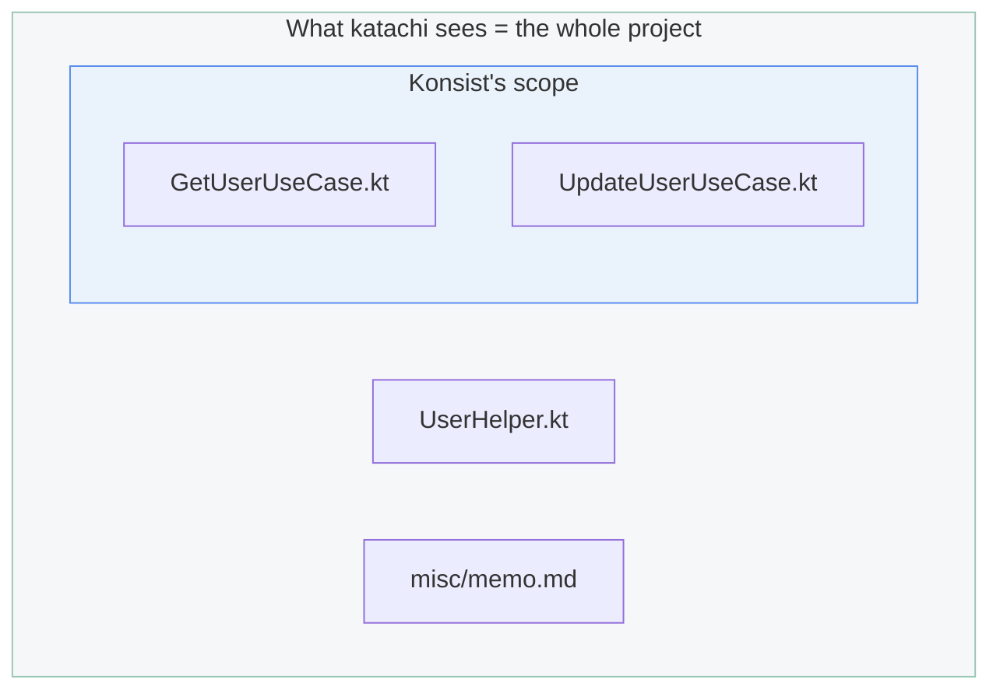
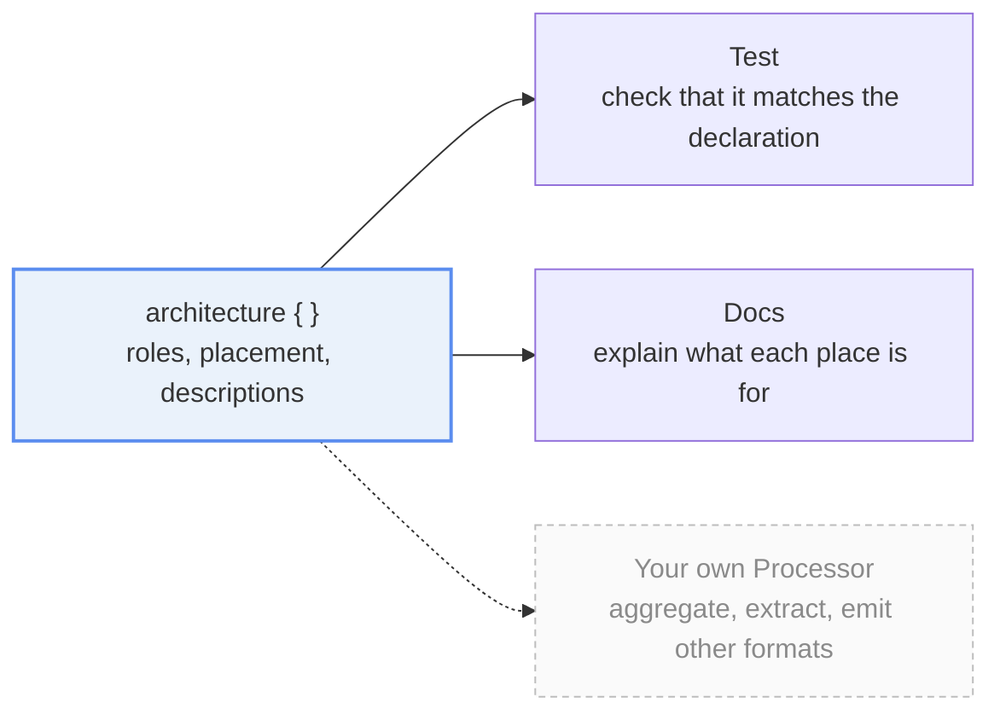

import { Aside, LinkCard, CardGrid, FileTree } from '@astrojs/starlight/components';

This page answers **why katachi has the shape it does**.
For how to install it and how to write definitions, see [Your first architecture definition](/katachi/get-started/first-architecture/).

## Why is an undeclared file a violation?

When an architecture breaks, it usually does not break because
**someone wrote something that violates a rule**; it breaks because **something appeared
in a place nobody had thought about.**

A deny-list ("`domain` must not import `android.*`")
**only protects you from the prohibitions you thought of.** The ways of breaking things you
did not think of pass straight through. And those are by far the most common ones.

The one difference is **which way the things you failed to enumerate fall** — that is all.

<details>
<summary>Where this meets security</summary>

Treating anything unexpected as suspicious is a habit security shares.

It is called **fail-safe defaults**, one of the design principles Saltzer and Schroeder
listed in 1975: decide access **by enumerating what is permitted, not what is denied**.
Starting a firewall from default deny, and starting a CSP from `default-src 'none'`,
are both expressions of that same principle.

The reasoning is the same too. **A scheme that enumerates prohibitions lets through
whatever it failed to enumerate.** Just as signature-based malware protection cannot stop an
unknown sample, **when something slips past, it falls to the "passes quietly" side.**
With a scheme that enumerates permissions, whatever slips past falls to the "does not pass" side.
It is a choice of which way you want it to fall.

**The price is the same as well.** Allow-lists are laborious to enumerate and heavy to
maintain. They are still adopted at boundaries worth defending. katachi being "heavy at the
start" is the same story.

That said, katachi is not a security tool. All it borrows is the shape of the decision;
what it defends is your architecture.

</details>

katachi does the opposite: **it makes you write down everything that may appear.** Anything you
did not write down is a violation. That way "we never thought about it" cannot happen,
because the unanticipated thing is itself the violation.

The price, honestly, is that **the start is heavy.** The test will not go green until every
file in the project has been accounted for. Even so, we think **the fact that some files cannot
be accounted for is itself the information.** Do you really need that file?

## Won't an existing project be nothing but violations?

Yes. **That is the normal starting point.**

The list of violations from the first run is, as it stands, a report saying
**"this project contains this many files that nobody can account for."**
katachi did not break anything; it only made visible what was already there.

You will work through the reported paths one at a time, adding each to the definition,
moving it, or deleting it. That work is itself **the team agreeing on its architecture again.**

<Aside title="If you want to accept the current state for now">
We understand the request: "leave what is already here alone, and only stop new things from
being added." **It is planned as a baseline feature, but it is not implemented yet**
([Roadmap](/katachi/roadmap/)). For now, you can take the list of violations via `process()`
and subtract them yourself.
</Aside>

## Konsist and ArchUnit exist — why does anything else need to?

**They look at a different range.**

Konsist and ArchUnit are tools for **narrowing down a target and then checking its contents**.

```kt title="UseCaseKonsistTest.kt" {1-4}
// narrowing happens here
Konsist.scopeFromProject()
    .classes()
    .withNameEndingWith("UseCase")   

    // only what the filter caught is checked
    .assertTrue { /* ... */ }
```

Written this way, **anything the net does not catch is never checked.**

<FileTree>
- src/main/kotlin/com/example/
  - useCase/
    - **GetUserUseCase.kt** in Konsist's field of view
  - **UserHelper.kt** the name does not match, so it stays out of view
  - misc/
    - **memo.md** the whole directory is out of view to begin with
</FileTree>

katachi works the other way around. **It walks the whole project and matches it against the declaration.**



To find "something is here that should not be", you need **a tool that looks at the whole.**

## So does Konsist become unnecessary?

No, **you use both. They do different jobs.**

| | What it looks at |
|---|---|
| katachi | **Where** a file is. The structure of the whole project |
| Konsist | **What is inside** a file. Classes, functions, visibility |

"A `UseCase` goes in the `useCase/` directory" is katachi's job.
"A `UseCase` has exactly one `invoke` function" is Konsist's job.

Because you can write Konsist constraints inside a katachi definition,
**placement violations and content violations end up in a single report.**

And Konsist is not the only tool that occupies the "check the contents of a file" position.
If you use custom [detekt](https://detekt.dev/) rules or [Konture](https://github.com/baole/konture), those may serve as a substitute for Konsist, depending on the rule you want to check.


<CardGrid>
  <LinkCard
    title="Konsist integration"
    description="How to write konsist { }, and how it all lands in one report."
    href="/katachi/guides/konsist-integration/"
  />
  <LinkCard
    title="Comparison with other tools"
    description="How detekt, Konture, and the rest — the tools that check contents — relate to katachi."
    href="/katachi/get-started/comparison-with-other-tools/"
  />
</CardGrid>

## Why is there only one test?

Because **one run should tell you everything.**

If you split the tests up per rule, a test stops at the first failure.
Fix it, rerun, learn about the next violation, fix again. **You get one round trip per violation.**

katachi calls `assert()` once, and every violation in the repository gathers into **a single
failure message**. If ten things are wrong, all ten come out at once. You read it once.

```text title="What a single run gives you" {1}
Katachi check failed: 3 violations (Unexpected: 2, Missing: 1)

[UnexpectedFile] src/main/kotlin/com/example/GetUserUseCase.kt
  No role is defined for this file.

  Nearby locations:
    UseCase    src/main/kotlin/com/example/useCase/

  How to fix:
    - Move it to one of the locations above
    ...

[UnexpectedDirectory] src/main/kotlin/com/example/misc
  ...

[MissingFile] src/main/kotlin/com/example/useCase/DeleteUserUseCase.kt
  ...
```

The first line carries **the total and the breakdown**. Read it and you know the scale before
you read the rest.

This is convenient for a human, but **for an AI agent it is decisive.**
It is the difference between gathering everything you need to fix in one test run and making
ten round trips.

## If the test passes, why generate documentation?

**Generating documentation is optional, but recommended**, because a test is not an explanation
written for humans.

All `assert()` guarantees is that things match the definition.
What a newcomer or an AI agent wants to know is **why** the structure is this way, and that does
not appear in the test output.

Write that documentation separately, though, and **it will rot.** Rotten documentation is worse
than none at all, because nobody notices that it contradicts the implementation.

So katachi **produces both from the same definition**. The `summary` and `description` you write
in a role are at once the subject of the check and the body of the documentation.



Because the architecture definition is the single source of truth, **one side going stale on its
own is structurally impossible.**

Tests and documentation are what katachi ships, but **you are not limited to those two.**
You can pull whatever you want out of the same definition
([ArchitectureProcessor and customizing it](/katachi/guides/processor/)).

<Aside type="caution">
Documentation generation is **planned for v0.2 and does not work yet.**
What you can use today is the check (`assert()`).
</Aside>

## How do I decide the names and the granularity of roles?

Use this criterion: **is the team already using that word?**

Roles in katachi are not there to introduce new concepts.
They take the words already used out loud and in review — "this is a UseCase, right?",
"put it in the Repository" — and write them down as declarations.

That makes **the definition an agreement of the team**, and an important subject of review.
Even when you have an AI agent produce the initial definition, that is no more than a guess from
the existing code, so **the team is expected to read it and agree on it in the end**.
