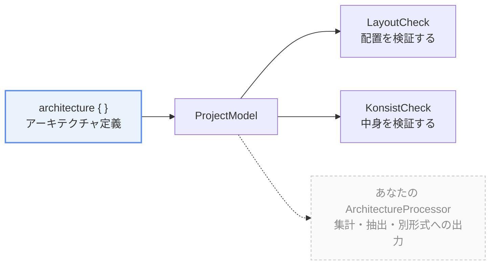

import { Aside, Tabs, TabItem } from "@astrojs/starlight/components"

## ArchitectureProcessor とは

katachi の `ArchitectureProcessor` クラスはアーキテクチャ定義を元に 何かを行う interface です。

```kt
public interface ArchitectureProcessor<out R> {
    public fun process(model: ProjectModel): R
}
```

## katachi の 2 要素

katachi は 大きく分けて **アーキテクチャ定義** と **ArchitectureProcessor** の2つの要素から成ります。



定義そのものは何も実行しません。**`ProjectModel` を受け取って何かをするのが ArchitectureProcessor** で、katachi が同梱しているものも、あなたが書くものも、区別はありません。

アーキテクチャ定義は `architecture { }` ブロックの中で記載するプロジェクトのアーキテクチャの定義です。

アーキテクチャを定義しただけでは何も起こりません。それを利用して何かを行うのが ArchitectureProcessor です。

## ビルトインの ArchitectureProcessor

katachi はデフォルトで 3 つの ArchitectureProcessor を提供しています。

| Processor | 何を行うか？ | ドキュメント |
| --- | --- | --- |
| `projectArchitecture.assert()` (`LayoutCheck`) | アーキテクチャ定義に沿ったファイル配置になっているかを検証して エラーがある場合はアサーション例外を発生させます。 |  |
| `GenerateDocumentation` | プロジェクト定義に書かれた summary, description などのプロパティをもとにドキュメントを生成します。 | |
| `GenerateCodeFromTemplate` | プロジェクト定義内の `template { }` ブロックの内容をもとにファイルを生成します。 | |

いずれも プロジェクトのアーキテクチャ定義を受け取り、それらを何かしらの生成に役立てています。

## ArchitectureProcessor の実行

ArchitectureProcessor を実行する方法のパターンがいくつかあります。

ArchitectureProcessor ごとに推奨される実行方法は異なるため、個々の ArchitectureProcessor の実行方法についてはそれぞれのドキュメントを参照してください。

### 実行方法1. 用意されている API をプログラムから呼び出す

ArchitectureProcessor とともに用意されている API （多くの場合トップレベル関数）がある場合、その API を呼び出すことで ArchitectureProcessor を実行できます。

例えば LayoutCheck であれば `projectArchitecture.assert()` を呼び出すことでその ArchitectureProcessor を実行できます。

```kt
projectArchitecture.assert() // 内部で LayoutCheck().process(...) を呼び出す
```

### 実行方法2. コマンドラインから実行する

katachi gradle plugin には ArchitectureProcessor を実行するための `runKatachiProcessor` Gradle タスクが用意されています。

```shell
# GenerateCodeFromTemplate を実行する例 

# runKatachiProcessor task を実行します
./gradlew runKatachiProcessor \
  # entrypoint に実行したい ArchitectureProcessor の factory を指定します
  --entrypoint='me.tbsten.katachi.template.GenerateCodeFromTemplate$FromArgs' \
  # -P で ArchitectureProcessor に渡す引数を指定します
  -Prole='UseCase' -Pname='GetItemList' -PinvokeImpl='TODO()' // ...
```

## カスタムの ArchitectureProcessor

ArchitectureProcessor は単純な interface として提供されているため あなたが独自に実装して自由に処理を追加することが可能です。

### 1. ArchitectureProcessor を実装する

ArchitectureProcessor を実装したクラスを用意して process メソッドを実装してください。

```kt
class MyProcessor : ArchitectureProcessor<MyResult> {
    override fun process(model: ProjectModel): MyResult {
        // model.roles           -> 定義された Role の一覧
        // model.groups          -> group の一覧
        // model.declaredEntries -> layout { } を平坦化した宣言の一覧
        // model.filesOf(role)   -> その Role が実際に持っているファイルのパス
        return model.roles.associate { it.qualifiedName to model.filesOf(it).size }
    }
}
```

`ProjectModel` が渡してくれるのはこの4つだけです。**アーキテクチャ定義そのものやファイルシステムには触れません。** 走査の結果だけが渡される形なので、processor はファイルを読みに行く必要がありません。

戻り値の型は自分で決められます。値を返さず副作用だけを持つ processor には `ArchitectureProcessorUnit`（`ArchitectureProcessor<Unit>` の別名）が使えます。

<details>
<summary>アーキテクチャ定義に独自のプロパティが必要になった場合</summary>

場合によっては ArchitectureProcessor 利用側でアーキテクチャ定義に指定してほしい独自のプロパティが必要になるかもしれません。
その場合は `Role の metadata` を利用することができます。

例えばすでに非推奨になったものの過去の遺産として残ってしまっている Role を Deprecated としてマークしたい場合、以下のように Deprecated という metadata を定義して設定することができます。

```kt {1-2, 8-9, 17} nocollapse
val Deprecated = metadata<Boolean>() // metadata のキー
var MetadataScope.deprecated: Boolean? by Deprecated

// Processor 側
class MyProcessor : ArchitectureProcessor<Unit> {
   override fun process(model: ProjectModel) {
      for (role in model.roles) {
         // Role[metadata のキー] で metadata の値を取得
         val deprecated: Boolean? = role[Deprecated]
      }
   }
}

// 利用側
architecture {
   "UseCase" {
      deprecated = true
   }
}
```

</details>

### 2. ArchitectureProcessor を実行する方法を用意する

利用者が ArchitectureProcessor を実行する方法を用意してください。

API としてプログラムから実行したい場合は API を用意する方法が、ワンショットで実行したい場合は コマンドラインから実行する方法が推奨されます。

<Tabs>
    <TabItem label="API を用意する">

        `Architecture` の拡張関数を1本生やします。katachi が `assert()` を用意しているのと同じ形です。

        ```kt
        // MyProcessor と同じファイルに置く
        @OptIn(ExperimentalKatachiApi::class)
        fun Architecture.countFiles(): MyResult = process(MyProcessor())
        ```

        利用者は processor の存在を知らずに済みます。

        ```kt
        val counts = projectArchitecture.countFiles()
        ```

    </TabItem>
    <TabItem label="Gradle タスクから実行する">

        引数を受け取れるように、**処理の本体とは別に入口を用意します**。

        ```kt
        class MyProcessor : ArchitectureProcessor<MyResult> {
            override fun process(model: ProjectModel): MyResult {
                // ...
            }

            // 引数から MyProcessor を組み立てる。Gradle タスクが呼ぶのはこちら
            object FromArgs : (Map<String, String>) -> MyProcessor {
                  override fun invoke(args: Map<String, String>) =
                     MyProcessor(role = args.getValue("role"))
            }
        }
        ```

        処理そのものは `MyProcessor` に閉じたままなので、**同じクラスを API からもコマンドラインからも使えます**。

    </TabItem>
</Tabs>

用意した実行方法は **processor の KDoc に書いてください。** 利用者が最初に読むのはクラスの KDoc で、「どう呼ぶか」がそこに無いと、このページまで戻ってこないといけません。`## Example` としてコード例を置くのが katachi の書き方です。

## まとめ

- **`assert()` もドキュメント・テンプレート生成も ArchitectureProcessor** です。
- 同じ仕組みに乗っかってカスタムの ArchitectureProcessor を作ることもできます。

## 次のステップ

- [ロードマップ](/katachi/roadmap/) ... この仕組みの上に乗る予定のドキュメント生成と Gradle plugin が、どのバージョンで来るのかを確かめましょう。
