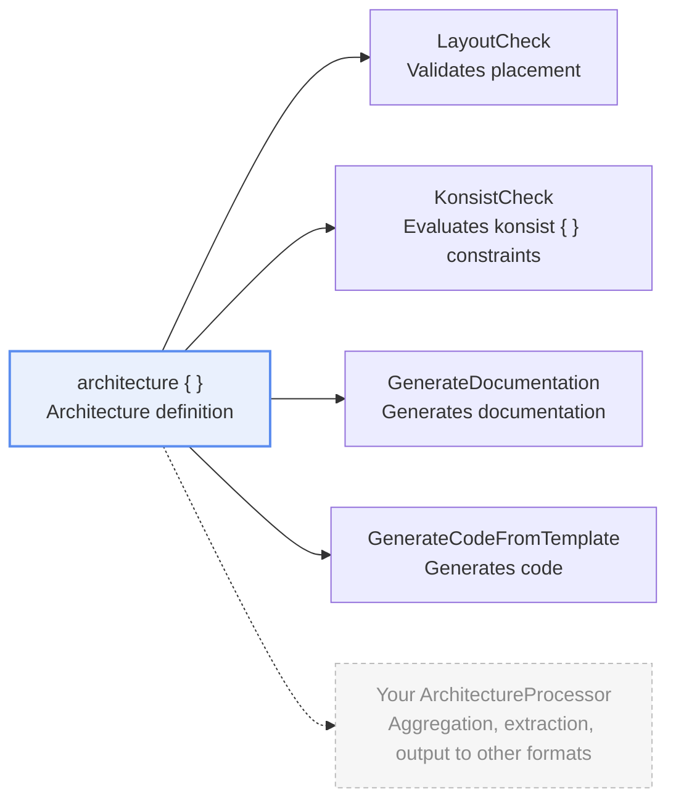

import { Aside, Tabs, TabItem } from "@astrojs/starlight/components"

This page aims to deepen your understanding of katachi by explaining ArchitectureProcessor, one of katachi's key elements.

The latter half explains how to write and run your own ArchitectureProcessor.

## What is ArchitectureProcessor

katachi's `ArchitectureProcessor` class is an interface that does something based on an architecture definition.

```kt
public interface ArchitectureProcessor<Args, R> {
    public val argsSerializer: KSerializer<Args>
    public fun process(context: ArchitectureProcessContext<Args>): Result<R>
}
```

Wrap the body of `process` in `runCatching { }`. **To answer "this run does not pass", throw inside it.** There is no need to build `Result.success` / `Result.failure` by hand.

| Inside `runCatching { }` | Meaning | In `runKatachiProcessor` |
| --- | --- | --- |
| Reaches the end and returns a value | The run passes | `[OK]` |
| Throws | The run does not pass (violations found, documentation out of date, the job could not be done, and so on) | `[FAILED]`. The exception's message is printed and the exit code is non-zero |

A check that returns a list of violations calls `assertNoErrors()` last. It throws `KatachiArchitectureAssertionError` when there is a `Severity.Error` violation, and returns the list as it is when there are only warnings. `assert()` reads that exception as "found violations" and puts them into the one report; any other exception means the check could not answer, and is reported as `[UncheckedCheck]`. `LayoutCheck` and `KonsistCheck` are written this way too.

An ArchitectureProcessor that doesn't take arguments implements `ArchitectureProcessorNoArg<R>`. It's a thin interface that just takes care of writing `argsSerializer` for you.

```kt
public interface ArchitectureProcessorNoArg<R> : ArchitectureProcessor<Unit, R>
```

## katachi's two elements

Broadly speaking, katachi consists of two elements: the **architecture definition** and **ArchitectureProcessor**.


```mermaid
flowchart LR
    D["architecture { }<br/>Architecture definition"]
    D --> Layout["LayoutCheck<br/>Validates placement"]
    D --> Konsist["KonsistCheck<br/>Evaluates konsist { } constraints"]
    D --> Doc["GenerateDocumentation<br/>Generates documentation"]
    D --> Template["GenerateCodeFromTemplate<br/>Generates code"]
    D -.-> Custom["Your ArchitectureProcessor<br/>Aggregation, extraction, output to other formats"]

    style D fill:#5B8DEF22,stroke:#5B8DEF,stroke-width:2px
    style Custom fill:#BDBDBD22,stroke:#BDBDBD,stroke-dasharray:4 3,color:#8A8A8A
```

The architecture definition itself doesn't execute anything. **It's `ArchitectureProcessor` that takes an `ArchitectureProcessContext` and does something with it.**

- The architecture definition is the definition of your project's architecture, written inside an `architecture { }` block.
- Defining an architecture by itself doesn't do anything. It's ArchitectureProcessor that uses it to do something.

## Built-in ArchitectureProcessors

katachi ships with four ArchitectureProcessors.

| Processor | What it does | Documentation |
| --- | --- | --- |
| `projectArchitecture.assert()` (`LayoutCheck`) | Validates whether files are placed according to the architecture definition, and throws an assertion exception if there are errors. |  |
| `KonsistCheck` | Evaluates the constraints written in `konsist { }`. Passed as `projectArchitecture.assert(KonsistCheck())`. | [Konsist integration](/katachi/guides/konsist-integration/) |
| `GenerateDocumentation` | Generates documentation from properties such as summary and description written in the project definition. | [Document generation](/katachi/guides/document-generation/) |
| `GenerateCodeFromTemplate` | Generates files based on the contents of `template { }` blocks in the project definition. | [Generating code from a template](/katachi/guides/generate-code-from-template/) |

Each of them takes the project's architecture definition and puts it to use generating something.

## Running an ArchitectureProcessor

There are a few patterns for running an ArchitectureProcessor.

The recommended way to run it differs per ArchitectureProcessor, so refer to each ArchitectureProcessor's own documentation for how to run it.

### Method 1. Call a provided API from your program

If an API is provided alongside the ArchitectureProcessor (often a top-level function), you can run the ArchitectureProcessor by calling that API.

For example, for LayoutCheck, you can run that ArchitectureProcessor by calling `projectArchitecture.assert()`.

```kt
projectArchitecture.assert() // Internally calls LayoutCheck().process(...)
```

### Method 2. Run it from the command line

To run an ArchitectureProcessor from the command line, it needs to be registered through the Gradle plugin.

```kts title="architecture-test/build.gradle.kts" {5-6}
katachi {
    processors {
        // ...

        // ⭐️ Specify the ArchitectureProcessor name and its corresponding class name
        register("someProcessor", "com.example.SomeProcessor")
    }
}
```

<details>
    <summary>ArchitectureProcessors registered by default</summary>

    `docs` (documentation generation) and `template` (code generation from a template) are registered by default because they're common use cases.
    You don't need to register these ArchitectureProcessors in `katachi.processors` to run them.

    ```kts title="architecture-test/build.gradle.kts" {5-7}
    katachi {
        architecture = "com.example.projectArchitecture"

        processors {
            // ⭐️ These are unnecessary
            register("docs", "me.tbsten.katachi.docs.GenerateDocumentation")
            register("template", "me.tbsten.katachi.template.GenerateCodeFromTemplate")
        }
    }
    ```

</details>

The katachi Gradle plugin provides a `runKatachiProcessor` Gradle task for running an ArchitectureProcessor, so you can run one by executing this task.

```shell
# Example: running GenerateCodeFromTemplate

# Run the runKatachiProcessor task
./gradlew runKatachiProcessor \
  # Specify the name of the ArchitectureProcessor you want to run
  --processor='someProcessor' \
  # Use --arg to pass arguments to the ArchitectureProcessor
  --arg "someArg1=someValue1" --arg "someArg2=someValue2"
```

Example output:

```
TODO
```

---

## Custom ArchitectureProcessors

Because ArchitectureProcessor is provided as a simple interface, you can implement your own and freely add processing.

### 1. Implement ArchitectureProcessor

Prepare a class that implements ArchitectureProcessor and implement the `process` method.

The `context` passed as the argument to the `process` method holds the architecture definition, arguments, and so on, so refer to these as needed to implement your ArchitectureProcessor's logic.

```kt
object CountFilesPerRole : ArchitectureProcessorNoArg<Map<String, Int>> {
    override fun process(context: ArchitectureProcessContext<Unit>): Result<Map<String, Int>> = runCatching {
        // context.architecture    ... the architecture definition itself
        // context.roles / groups  ... the defined roles / groups
        // context.declaredEntries ... the flattened list of declarations from layout
        // context.filesOf(role)   ... the actual files that matched that role
        // context.args            ... arguments passed via --arg from the CLI (Unit if there are none)
        // context.fileSystem      ... the file system used for the walk
        // context.log()           ... outputs progress

        context.log("Counting files per role...")
        context.roles.associate { role -> role.name to context.filesOf(role).size }
    }
}
```

<Aside type="tip">
The walk happens **only once** within the Context. Both `roles` and `filesOf()` read the same result, so calling them repeatedly never re-reads the file tree.
</Aside>

{/* TODO: link to `ArchitectureProcessContext` once the API reference is out */}
For details on the information available from `context`, refer to `ArchitectureProcessContext`'s API documentation.

<details>
<summary>Role metadata</summary>

In some cases, the user of an ArchitectureProcessor may need a custom property that they want specified on the architecture definition.
In that case, you can use **Role metadata**.

For example, if you want to mark a Role that's already deprecated but still lingers as legacy baggage as Deprecated, you can define and set a metadata key called Deprecated as follows.

```kt nocollapse
// The metadata key. `Deprecated` collides with kotlin.Deprecated, so it's avoided
@OptIn(ExperimentalKatachiApi::class)
val Obsolete: MetadataKey<Boolean> = metadata()

@OptIn(ExperimentalKatachiApi::class)
var MetadataScope.obsolete: Boolean? by Obsolete

// Processor side
object ObsoleteRoles : ArchitectureProcessorNoArg<List<String>> {
    override fun process(context: ArchitectureProcessContext<Unit>): Result<List<String>> = runCatching {
        context.roles.filter { it[Obsolete] == true }.map { it.name }
    }
}

// Usage side
architecture {
   "UseCase" {
      obsolete = true
   }
}
```

`metadata<T>()` and `MetadataKey` are `@ExperimentalKatachiApi`. Metadata that hasn't been written **has no default value — it's simply "absent,"** so it's up to the reader to decide what to do when it's absent.

</details>

### 2. Provide a way to run ArchitectureProcessor

Provide a way for users to run your ArchitectureProcessor.

If you want it runnable from a program as an API, providing an API is recommended; if you want to run it as a one-shot, running it from the command line is recommended.

<Tabs>
    <TabItem label="Provide an API">

        Provide an extension function on `Architecture`. This is the same shape katachi uses to provide `assert()`.

        ```kt
        // Place this in the same file as CountFilesPerRole
        @OptIn(ExperimentalKatachiApi::class)
        fun Architecture.countFilesPerRole(): Map<String, Int> = process(CountFilesPerRole).getOrThrow()
        ```

        Users don't even need to know the processor exists.

        ```kt
        val counts = projectArchitecture.countFilesPerRole()
        ```

    </TabItem>
    <TabItem label="Run it from a Gradle task">

        TODO

        ```kt
        TODO
        ```

        For an ArchitectureProcessor that needs to receive arguments via `--arg` from the CLI, TODO

        ```kt
        TODO
        ```

        The processing itself stays contained in `MyProcessor`, so **you can use the same class from both the API and the command line**.

    </TabItem>
</Tabs>

**Write the way to run it in the processor's KDoc.** The first thing users read is the class's KDoc, and if "how to call it" isn't there, they'd have to come back to this page. Placing a code example under `## Example` is katachi's convention.

## Summary

- **`assert()`, as well as documentation and template generation, are all ArchitectureProcessors.**
- You can build your own custom ArchitectureProcessor on top of the same mechanism.

## Next steps

- [Roadmap](/katachi/roadmap/) ... Check which version will bring the documentation generation and Gradle plugin that are planned to sit on top of this mechanism.
