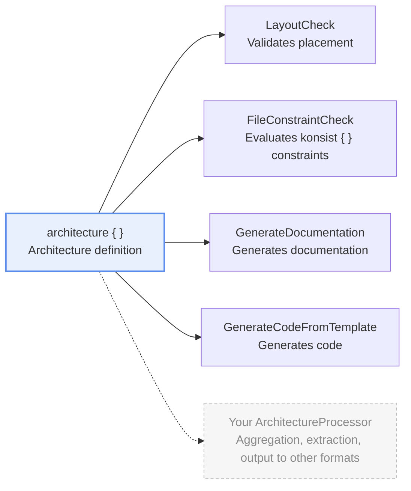

{/*
  The purpose of this page: to understand how the architecture definition and ArchitectureProcessor work, and how to write and run your own ArchitectureProcessor.
*/}

import { Tabs, TabItem, LinkCard } from "@astrojs/starlight/components"

This page aims to deepen your understanding of katachi by explaining ArchitectureProcessor, one of katachi's key elements.

The latter half explains how to write and run your own ArchitectureProcessor.

## What is ArchitectureProcessor

katachi's `ArchitectureProcessor` is an interface that does something based on an architecture definition.

```kt
@ExperimentalKatachiApi
public interface ArchitectureProcessor<Args, R> {
    // Parser for the arguments
    public val argsSerializer: KSerializer<Args>

    // Does something
    public fun process(context: ArchitectureProcessContext<Args>): Result<R>
}
```

Wrap the body of `process` in `runCatching { }` (or the `runCatchingScoped` utility). `runCatchingScoped` collects every problem you find with `failure(...)` and fails once at the end ([RoleDocCoverage.kt in sample/custom-processor](https://github.com/TBSten/katachi/blob/main/sample/custom-processor/architecture-test/src/test/kotlin/com/example/processors/RoleDocCoverage.kt)).

| Return value | Meaning | Handling in the Gradle task |
| --- | --- | --- |
| Result.success | Success | `[OK]` |
| Result.failure | Failure <br/> (violations found, documentation out of date, the job could not be done, and so on) | `[FAILED]`. The exception's message is printed and the exit code is non-zero |

## katachi's two elements

Broadly speaking, katachi consists of two elements: the **architecture definition** and **ArchitectureProcessor**.


```mermaid
flowchart LR
    D["architecture { }<br/>Architecture definition"]
    D --> Layout["LayoutCheck<br/>Validates placement"]
    D --> Konsist["FileConstraintCheck<br/>Evaluates konsist { } constraints"]
    D --> Doc["GenerateDocumentation<br/>Generates documentation"]
    D --> Template["GenerateCodeFromTemplate<br/>Generates code"]
    D -.-> Custom["Your ArchitectureProcessor<br/>Aggregation, extraction, output to other formats"]

    style D fill:#5B8DEF22,stroke:#5B8DEF,stroke-width:2px
    style Custom fill:#BDBDBD22,stroke:#BDBDBD,stroke-dasharray:4 3,color:#8A8A8A
```

The architecture definition itself doesn't execute anything. **It's `ArchitectureProcessor` that takes an `ArchitectureProcessContext` and does something with it.**

- The architecture definition is the definition of your project's architecture, written inside an `architecture { }` block.
- Defining an architecture by itself doesn't do anything. It's ArchitectureProcessor that uses it to do something.

## Built-in ArchitectureProcessors

katachi ships with five ArchitectureProcessors.

<table>
    <thead>
        <tr>
            <th>Processor</th>
            <th style="min-width: 12rem;">What it does</th>
            <th style="min-width: 10rem;">Documentation</th>
        </tr>
    </thead>
    <tbody>
        <tr>
            <td><code>projectArchitecture.assert()</code><br />(<code>LayoutCheck</code>)</td>
            <td>Validates whether files are placed according to the architecture definition, and throws an assertion exception if there are errors.</td>
            <td></td>
        </tr>
        <tr>
            <td><code>FileConstraintCheck</code></td>
            <td>Evaluates the constraints written in <code>{"konsist { }"}</code>. Passed as <code>projectArchitecture.assert(FileConstraintCheck())</code>.</td>
            <td><a href="/katachi/guides/konsist-integration/">Konsist integration</a></td>
        </tr>
        <tr>
            <td><code>GenerateDocumentation</code></td>
            <td>Generates documentation from properties such as summary and description written in the project definition.</td>
            <td><a href="/katachi/guides/document-generation/">Document generation</a></td>
        </tr>
        <tr>
            <td><code>GenerateCodeFromTemplate</code></td>
            <td>Generates files based on the contents of the <code>{".template { }"}</code> attached to layout file declarations.</td>
            <td><a href="/katachi/guides/generate-code-from-template/">Generating code from a template</a></td>
        </tr>
        <tr>
            <td><code>DescribeTemplates</code></td>
            <td>Lists the declarations that have a <code>{".template { }"}</code>, or shows one template's parameters and the files it produces. It writes no files.</td>
            <td><a href="/katachi/guides/generate-code-from-template/">Generating code from a template</a></td>
        </tr>
    </tbody>
</table>

All of them take the project's architecture definition and use it for validation or generation.

## Running an ArchitectureProcessor

There are a few patterns for running an ArchitectureProcessor.

The recommended way to run it differs per ArchitectureProcessor, so refer to each ArchitectureProcessor's own documentation for how to run it.

<Tabs>
    <TabItem label="Call the API from your program">

If an API is provided alongside the ArchitectureProcessor (often a top-level function), you can run the ArchitectureProcessor by calling that API.

For example, for LayoutCheck, you can run that ArchitectureProcessor by calling `projectArchitecture.assert()`.

```kt
projectArchitecture.assert() // Internally calls LayoutCheck().process(...)
```

    </TabItem>
    <TabItem label="Run it from the command line">

To run an ArchitectureProcessor from the command line, it needs to be registered through the Gradle plugin.

```kts title="architecture-test/build.gradle.kts" {5-6}
katachi {
    processors {
        // ...

        // ⭐️ Specify the ArchitectureProcessor name and its corresponding class name
        register("someProcessor", "com.example.SomeProcessor")
    }
}
```

You can also set default values at the same time as registering.

```kts title="architecture-test/build.gradle.kts"
katachi {
    processors {
        // Write defaults at the same time you register
        register("someProcessor", "com.example.SomeProcessor") {
            arg("someArg1", "someValue1")
        }

        // Add defaults to an already-registered key
        args("docs") {
            arg("mode", "check")
        }
    }
}
```

A Gradle task is provided for each registered processor.

The task name is `katachi` plus the registered key with its first letter capitalized (for example, `register("someProcessor", ...)` becomes `katachiSomeProcessor`).

Example run:

```
$ ./gradlew katachiSomeProcessor
[1/3] Processors: someProcessor

[2/3] Processing...

========================================
[3/3] Katachi processor run: 1 succeeded, 0 failed

[OK] someProcessor

========================================
```

    </TabItem>
</Tabs>

---

## Custom ArchitectureProcessors

Because ArchitectureProcessor is provided as a simple interface, you can implement your own and freely add processing.

The sample/custom-processor module in the GitHub repository has examples of custom ArchitectureProcessors.

<LinkCard title="sample/custom-processor" description="Three processors — no arguments, with arguments, and a check — plus how they're registered" href="https://github.com/TBSten/katachi/tree/main/sample/custom-processor" />

### 1. Implement ArchitectureProcessor

Prepare a class that implements ArchitectureProcessorNoArg or ArchitectureProcessor, and implement the `process` method.

The `context` passed as the argument to the `process` method holds the architecture definition, arguments, and so on, so refer to these as needed to implement your ArchitectureProcessor's logic.

<Tabs>
    <TabItem label="No arguments">
        If your ArchitectureProcessor needs no arguments, implement the `ArchitectureProcessorNoArg` interface.

        Specify the return type at run time as the type argument.

        ```kt {2,3}
        // Define an object that implements ArchitectureProcessorNoArg
        object CountFilesPerRole : ArchitectureProcessorNoArg<Map<String, Int>> {
            override fun process(context: ArchitectureProcessNoArgContext): Result<Map<String, Int>> = runCatching {
                // context.architecture    ... the architecture definition
                // context.roles / groups  ... the defined Roles / groups
                // context.declaredEntries ... the flattened list of declarations from layout
                // context.filesOf(role)   ... the actual files that matched that Role
                // context.rawArgs         ... the arguments passed, as raw names and values
                // context.log()           ... outputs progress

                context.log("Counting files per role...")
                context.roles.associate { role -> role.name to context.filesOf(role).size }
            }
        }
        ```

    </TabItem>
    <TabItem label="With arguments">
        katachi uses [kotlinx.serialization](https://github.com/kotlin/kotlinx.serialization) to parse arguments, so add a kotlinx.serialization dependency to your project.

        ```kts {3} title="architecture-test/build.gradle.kts" 
        plugins {
            kotlin("jvm") version "<kotlin-version>"
            kotlin("plugin.serialization") version "<kotlin-version>"
        }
        ```        

        If your ArchitectureProcessor needs arguments, implement the `ArchitectureProcessor` interface.

        Specify the argument type as the first type argument and the return type as the second.

        ```kt {1, 3, 5, 16-17} nocollapse
        object CountFilesPerRole : ArchitectureProcessor<CountFilesPerRole.Args, Map<String, Int>> {
            // Pass the type of the value received via --arg, and how to read it
            override val argsSerializer: KSerializer<Args> = Args.serializer()

            override fun process(context: ArchitectureProcessContext<Args>): Result<Map<String, Int>> = runCatching {
                // Refer to the arguments using context.args
                val args: CountFilesPerRole.Args = context.args
                val prefix = args.prefix

                context.log("Counting files per role under $prefix...")
                context.roles
                    .filter { role -> role.qualifiedName.startsWith(prefix) }
                    .associate { role -> role.name to context.filesOf(role).size }
            }

            @Serializable
            data class Args(val prefix: String = "")
        }
        ```

    </TabItem>
</Tabs>

For details on the information available from `context`, refer to [`ArchitectureProcessContext`'s API reference](/katachi/api-docs/katachi/me.tbsten.katachi.processor/-architecture-process-context/index.html).

<details>
<summary>Role metadata</summary>

In some cases, the user of an ArchitectureProcessor may need a custom property that they want specified on the architecture definition.
In that case, you can use **Role metadata**.

For example, if you want to mark a Role that's already deprecated but still lingers as legacy baggage as Obsolete, you can define and set a metadata key called Obsolete as follows.

```kt nocollapse
// The metadata key
val Obsolete: MetadataKey<Boolean> = metadata()

var MetadataScope.obsolete: Boolean? by Obsolete

// Processor side
object ObsoleteRoles : ArchitectureProcessorNoArg<List<String>> {
    override fun process(context: ArchitectureProcessNoArgContext): Result<List<String>> = runCatching {
        context.roles.filter { it[Obsolete] == true }.map { it.name }
    }
}

// Usage side
architecture {
    "UseCase" {
        obsolete = true
    }
}
```

</details>

### 2. Provide a way to run ArchitectureProcessor

Provide a way for users to run your ArchitectureProcessor.

If you want it runnable from a program as an API, providing an API is recommended; if you want to run it as a one-shot, running it from the command line is recommended.

<Tabs>
    <TabItem label="Provide an API">

        Provide an extension function on `Architecture`. This is the same shape katachi uses to provide `assert()`.

        ```kt
        fun Architecture.countFilesPerRole(): Map<String, Int> = process(CountFilesPerRole, CountFilesPerRole.Args()).getOrThrow()
        ```

        For a definition without arguments, write `process(CountFilesPerRole)`.

        Users can call the provided API without needing to know the processor exists.

        ```kt
        val counts = projectArchitecture.countFilesPerRole()
        ```

    </TabItem>
    <TabItem label="Run it from a Gradle task">

        Once you register it in `katachi.processors.register`, you can call it as a Gradle task whose name is derived from the key (`countFilesPerRole` becomes `katachiCountFilesPerRole`).

        ```kts title="architecture-test/build.gradle.kts"
        katachi {
            processors {
                register("countFilesPerRole", "com.example.processors.CountFilesPerRole")
            }
        }
        ```

        ```shell
        ./gradlew katachiCountFilesPerRole
        ```

        `--arg` values are read according to the type of the matching field on `Args`. For the finer rules, such as which types split on commas, see [the API reference of `decodeFromStringMap`](/katachi/api-docs/katachi/me.tbsten.katachi.processor/decode-from-string-map.html).

    </TabItem>
</Tabs>

---

**Provide the way to run it as documentation, such as in the processor's KDoc, so that users are told how to run it as well.**

## Summary

- **`assert()`, as well as documentation and template generation, are all ArchitectureProcessors.**
- You can build a custom ArchitectureProcessor following the same mechanism the standard ArchitectureProcessors use.

## Next steps

- [ArchitectureProcessor API reference](/katachi/api-docs/katachi/me.tbsten.katachi.processor/-architecture-processor/index.html) ... The `ArchitectureProcessor` type and the APIs you can use in `process`.
- [Document generation](/katachi/guides/document-generation/) ... The biggest built-in processor built on the same mechanism.
    - See also the [KDoc](https://tbsten.github.io/katachi/api-docs/katachi/me.tbsten.katachi.docs/-generate-documentation/index.html) and [source code](https://github.com/TBSten/katachi/blob/main/katachi/src/main/kotlin/me/tbsten/katachi/docs/GenerateDocumentation.kt#L88) of the document generation ArchitectureProcessor.
- [Generating code from a template](/katachi/guides/generate-code-from-template/) ... The processor that produces code from the definition.
    - See also the [KDoc](https://tbsten.github.io/katachi/api-docs/katachi/me.tbsten.katachi.template/-generate-code-from-template/index.html) and [source code](https://github.com/TBSten/katachi/blob/main/katachi/src/main/kotlin/me/tbsten/katachi/template/GenerateCodeFromTemplate.kt#L114) of the code-from-template ArchitectureProcessor.
