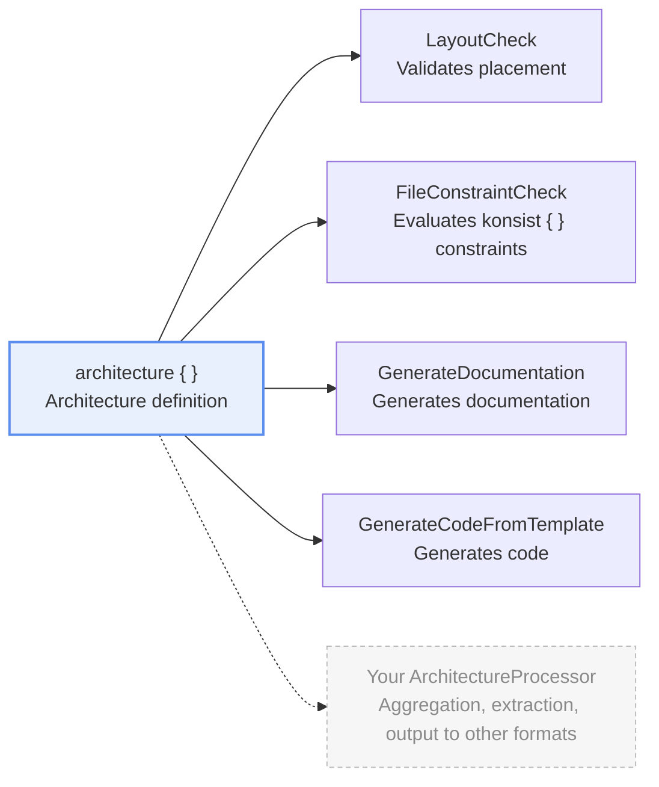

import { Aside, Tabs, TabItem, LinkCard } from "@astrojs/starlight/components"

This page aims to deepen your understanding of katachi by explaining ArchitectureProcessor, one of katachi's key elements.

The latter half explains how to write and run your own ArchitectureProcessor.

## What is ArchitectureProcessor

katachi's `ArchitectureProcessor` class is an interface that does something based on an architecture definition.

```kt
@ExperimentalKatachiApi
public interface ArchitectureProcessor<Args, R> {
    // Parser for the arguments
    public val argsSerializer: KSerializer<Args>

    // Does something
    public fun process(context: ArchitectureProcessContext<Args>): Result<R>

    // (Excerpt. Members with a default implementation, such as undeclaredArgNames, are omitted)
}
```

`ArchitectureProcessor` is `@ExperimentalKatachiApi`.

Wrap the body of `process` in `runCatching { }`. **To answer "this run does not pass", throw inside it.**

| Return value | Meaning | Handling in the Gradle task |
| --- | --- | --- |
| Result.success | The run passes | `[OK]` |
| Result.failure | The run does not pass (violations found, documentation out of date, the job could not be done, and so on) | `[FAILED]`. The exception's message is printed and the exit code is non-zero |

## katachi's two elements

Broadly speaking, katachi consists of two elements: the **architecture definition** and **ArchitectureProcessor**.


```mermaid
flowchart LR
    D["architecture { }<br/>Architecture definition"]
    D --> Layout["LayoutCheck<br/>Validates placement"]
    D --> Konsist["FileConstraintCheck<br/>Evaluates konsist { } constraints"]
    D --> Doc["GenerateDocumentation<br/>Generates documentation"]
    D --> Template["GenerateCodeFromTemplate<br/>Generates code"]
    D -.-> Custom["Your ArchitectureProcessor<br/>Aggregation, extraction, output to other formats"]

    style D fill:#5B8DEF22,stroke:#5B8DEF,stroke-width:2px
    style Custom fill:#BDBDBD22,stroke:#BDBDBD,stroke-dasharray:4 3,color:#8A8A8A
```

The architecture definition itself doesn't execute anything. **It's `ArchitectureProcessor` that takes an `ArchitectureProcessContext` and does something with it.**

- The architecture definition is the definition of your project's architecture, written inside an `architecture { }` block.
- Defining an architecture by itself doesn't do anything. It's ArchitectureProcessor that uses it to do something.

## Built-in ArchitectureProcessors

katachi ships with five ArchitectureProcessors.

| Processor | What it does | Documentation |
| --- | --- | --- |
| `projectArchitecture.assert()` (`LayoutCheck`) | Validates whether files are placed according to the architecture definition, and throws an assertion exception if there are errors. |  |
| `FileConstraintCheck` | Evaluates the constraints written in `konsist { }`. Passed as `projectArchitecture.assert(FileConstraintCheck())`. | [Konsist integration](/katachi/guides/konsist-integration/) |
| `GenerateDocumentation` | Generates documentation from properties such as summary and description written in the project definition. | [Document generation](/katachi/guides/document-generation/) |
| `GenerateCodeFromTemplate` | Generates files based on the contents of `template { }` blocks in the project definition. | [Generating code from a template](/katachi/guides/generate-code-from-template/) |
| `DescribeTemplates` | Lists the roles that have a `template { }`, or shows one template's parameters and the files it produces, without writing anything. | [Generating code from a template](/katachi/guides/generate-code-from-template/) |

Each of them takes the project's architecture definition and puts it to use, either for checking (`LayoutCheck` / `FileConstraintCheck`) or for generating (`GenerateDocumentation` / `GenerateCodeFromTemplate`).

## Running an ArchitectureProcessor

There are a few patterns for running an ArchitectureProcessor.

The recommended way to run it differs per ArchitectureProcessor, so refer to each ArchitectureProcessor's own documentation for how to run it.

<Tabs>
    <TabItem label="Call the API from your program">

If an API is provided alongside the ArchitectureProcessor (often a top-level function), you can run the ArchitectureProcessor by calling that API.

For example, for LayoutCheck, you can run that ArchitectureProcessor by calling `projectArchitecture.assert()`.

```kt
projectArchitecture.assert() // Internally calls LayoutCheck().process(...)
```

    </TabItem>
    <TabItem label="Run it from the command line">

To run an ArchitectureProcessor from the command line, it needs to be registered through the Gradle plugin.

```kts title="architecture-test/build.gradle.kts" {5-6}
katachi {
    processors {
        // ...

        // ⭐️ Specify the ArchitectureProcessor name and its corresponding class name
        register("someProcessor", "com.example.SomeProcessor")
    }
}
```

You can also set default values at the same time as registering.

```kts title="architecture-test/build.gradle.kts"
katachi {
    processors {
        // Write defaults at the same time you register
        register("someProcessor", "com.example.SomeProcessor") {
            arg("someArg1", "someValue1")
        }

        // Add defaults to an already-registered key
        args("docs") {
            arg("mode", "check")
        }
    }
}
```

<details>
    <summary>ArchitectureProcessors registered by default</summary>

    `docs` (documentation generation), `template` (code generation from a template) and `templates` (listing and describing templates) are registered by default because they're common use cases.
    You don't need to register these ArchitectureProcessors in `katachi.processors` to run them.

    Besides these, `internalTemplatesJson` (task `katachiInternalTemplatesJson`), which the IDE plugin uses, is registered as well. It exists for the IDE plugin, so you don't need to run it yourself.

    ```kts title="architecture-test/build.gradle.kts" {5-8}
    katachi {
        architecture = "com.example.projectArchitecture"

        processors {
            // ⭐️ These are unnecessary
            register("docs", "me.tbsten.katachi.docs.GenerateDocumentation")
            register("template", "me.tbsten.katachi.template.GenerateCodeFromTemplate")
            register("templates", "me.tbsten.katachi.template.DescribeTemplates")
        }
    }
    ```

</details>

A Gradle task is provided for each registered processor.

The task name is `katachi` plus the registered key with its first letter capitalized (for example, `register("someProcessor", ...)` becomes `katachiSomeProcessor`).

Example output:

```
[1/3] Processors: docs

[2/3] Processing...
  [docs] Writing 18 pages to file:///path/to/sample/jvm/docs
  [docs] README.md
  [docs] api/
  [docs]   README.md
  [docs]   Controller.md
  [docs] domain/
  [docs]   README.md
  [docs]   Service.md

========================================
[3/3] Katachi processor run: 1 succeeded, 0 failed

[OK] docs

========================================
```

When an exception is thrown inside `process`'s `runCatching { }`, the display becomes `[FAILED] docs`, the `1 succeeded, 0 failed` counts change too, and the task's exit code becomes non-zero. When the processor's return value is a `Collection`, each element is printed on its own line.

    </TabItem>
</Tabs>

---

## Custom ArchitectureProcessors

Because ArchitectureProcessor is provided as a simple interface, you can implement your own and freely add processing.

<Aside>

The sample/custom-processor module in the GitHub repository has examples of custom ArchitectureProcessors.

<LinkCard title="sample/custom-processor" description="Three processors — no arguments, with arguments, and a check — plus how they're registered" href="https://github.com/TBSten/katachi/tree/main/sample/custom-processor" />

</Aside>

### 1. Implement ArchitectureProcessor

Prepare a class that implements ArchitectureProcessor and implement the `process` method.

The `context` passed as the argument to the `process` method holds the architecture definition, arguments, and so on, so refer to these as needed to implement your ArchitectureProcessor's logic.

<Tabs>
    <TabItem label="No arguments">
        ```kt {3,4}
        // Define an object that implements ArchitectureProcessorNoArg
        @OptIn(ExperimentalKatachiApi::class)
        object CountFilesPerRole : ArchitectureProcessorNoArg<Map<String, Int>> {
            override fun process(context: ArchitectureProcessNoArgContext): Result<Map<String, Int>> = runCatching {
                // context.architecture    ... the architecture definition
                // context.roles / groups  ... the defined roles / groups
                // context.declaredEntries ... the flattened list of declarations from layout
                // context.filesOf(role)   ... the actual files that matched that role
                // context.rawArgs         ... the arguments passed, as raw names and values
                // context.log()           ... outputs progress

                context.log("Counting files per role...")
                context.roles.associate { role -> role.name to context.filesOf(role).size }
            }
        }
        ```

    </TabItem>
    <TabItem label="With arguments">
        To build an ArchitectureProcessor that takes arguments, use [kotlinx.serialization](https://github.com/kotlin/kotlinx.serialization) to parse them.

        ```kts {3} title="architecture-test/build.gradle.kts" 
        plugins {
            kotlin("jvm") version "<kotlin-version>"
            kotlin("plugin.serialization") version "<kotlin-version>"
        }
        ```        

        `kotlin("plugin.serialization")` is all you need. katachi exposes `kotlinx-serialization-core` as a dependency, so as long as you depend on katachi, `KSerializer` and `@Serializable` are available as they are.

        ```kt {2, 4, 6, 18} nocollapse
        @OptIn(ExperimentalKatachiApi::class)
        object CountFilesPerRole : ArchitectureProcessor<CountFilesPerRole.Args, Map<String, Int>> {
            // Pass the type of the value received via --arg, and how to read it
            override val argsSerializer: KSerializer<Args> = Args.serializer()

            override fun process(context: ArchitectureProcessContext<Args>): Result<Map<String, Int>> = runCatching {
                // Refer to the arguments using context.args
                val args: CountFilesPerRole.Args = context.args
                val prefix = args.prefix

                context.log("Counting files per role under $prefix...")
                context.roles
                    .filter { role -> role.qualifiedName.startsWith(prefix) }
                    .associate { role -> role.name to context.filesOf(role).size }
            }

            @Serializable
            data class Args(val prefix: String = "")
        }
        ```

    </TabItem>
</Tabs>

For details on the information available from `context`, refer to [`ArchitectureProcessContext`'s API reference](/katachi/api-docs/katachi/me.tbsten.katachi.processor/-architecture-process-context/index.html).

<details>
<summary>Role metadata</summary>

In some cases, the user of an ArchitectureProcessor may need a custom property that they want specified on the architecture definition.
In that case, you can use **Role metadata**.

For example, if you want to mark a Role that's already deprecated but still lingers as legacy baggage as Obsolete, you can define and set a metadata key called Obsolete as follows.

```kt nocollapse
// The metadata key
@OptIn(ExperimentalKatachiApi::class)
val Obsolete: MetadataKey<Boolean> = metadata()

@OptIn(ExperimentalKatachiApi::class)
var MetadataScope.obsolete: Boolean? by Obsolete

// Processor side
@OptIn(ExperimentalKatachiApi::class)
object ObsoleteRoles : ArchitectureProcessorNoArg<List<String>> {
    override fun process(context: ArchitectureProcessNoArgContext): Result<List<String>> = runCatching {
        context.roles.filter { it[Obsolete] == true }.map { it.name }
    }
}

// Usage side
architecture {
   "UseCase" {
      obsolete = true
   }
}
```

`metadata<T>()` and `MetadataKey` are `@ExperimentalKatachiApi`. Metadata that hasn't been written **has no default value — it's simply "absent,"** so it's up to the reader to decide what to do when it's absent.

</details>

### 2. Provide a way to run ArchitectureProcessor

Provide a way for users to run your ArchitectureProcessor.

If you want it runnable from a program as an API, providing an API is recommended; if you want to run it as a one-shot, running it from the command line is recommended.

<Tabs>
    <TabItem label="Provide an API">

        Provide an extension function on `Architecture`. This is the same shape katachi uses to provide `assert()`.

        ```kt
        @OptIn(ExperimentalKatachiApi::class)
        fun Architecture.countFilesPerRole(): Map<String, Int> = process(CountFilesPerRole, CountFilesPerRole.Args()).getOrThrow()
        ```

        Users can call the provided API without needing to know the processor exists.

        ```kt
        val counts = projectArchitecture.countFilesPerRole()
        ```

    </TabItem>
    <TabItem label="Run it from a Gradle task">

        Once you register it in `katachi.processors.register`, you can call it as a Gradle task whose name is derived from the key (`countFilesPerRole` becomes `katachiCountFilesPerRole`).

        ```kts title="architecture-test/build.gradle.kts"
        katachi {
            processors {
                register("countFilesPerRole", "com.example.processors.CountFilesPerRole")
            }
        }
        ```

        ```shell
        ./gradlew katachiCountFilesPerRole
        ```

        If you want to receive arguments via `--arg`, declare a `@Serializable` class as `Args` and return its `argsSerializer`.

        Implement `ArchitectureProcessor<Args, R>` rather than `ArchitectureProcessorNoArg`.

        ```kt
        @OptIn(ExperimentalKatachiApi::class)
        object RoleNames : ArchitectureProcessor<RoleNames.Args, List<String>> {
            override val argsSerializer: KSerializer<Args> = Args.serializer()

            override fun process(context: ArchitectureProcessContext<Args>): Result<List<String>> = runCatching {
                context.log("Listing roles with prefix=${context.args.prefix}")
                context.roles.map { it.qualifiedName }.filter { it.startsWith(context.args.prefix) }
            }

            @Serializable
            data class Args(val prefix: String = "")
        }
        ```

        ```kts title="architecture-test/build.gradle.kts"
        katachi {
            processors {
                register("roleNames", "com.example.processors.RoleNames")
            }
        }
        ```

        ```shell
        ./gradlew katachiRoleNames --arg prefix=domain/
        ```

        Having `Args` means that module needs `kotlin("plugin.serialization")`. A processor that takes no arguments doesn't need it.

        <details>
            <summary>How `--arg` values are read</summary>

            `--arg` values arrive as strings, and are read according to the type of the matching field on `Args`.

            | Field type | How it's passed |
            | --- | --- |
            | `String` | Passed through as-is. Commas aren't split either, so `--arg a=x,y` becomes `"x,y"` |
            | `Int`, `Long`, `Boolean`, etc. | Read from the string. `--arg count=2`, `--arg dryRun=true` |
            | `List<String>`, `Set<String>` | **Split on commas.** `--arg groups=core,testing` |
            | `enum` | Passed by the entry's name (or its `@SerialName` if it has one). Case must match too |
            | `Map`, nested `@Serializable` | Not supported |

        </details>

    </TabItem>
</Tabs>

---

**Provide the way to run it as documentation, such as in the processor's KDoc, so users learn the whole way to run it.**

## Summary

- **`assert()`, as well as documentation and template generation, are all ArchitectureProcessors.**
- You can build your own custom ArchitectureProcessor on top of the same mechanism.

## Next steps

- [Document generation](/katachi/guides/document-generation/) ... The biggest built-in processor built on the same mechanism.
- [Generating code from a template](/katachi/guides/generate-code-from-template/) ... The processor that produces code from the definition.
