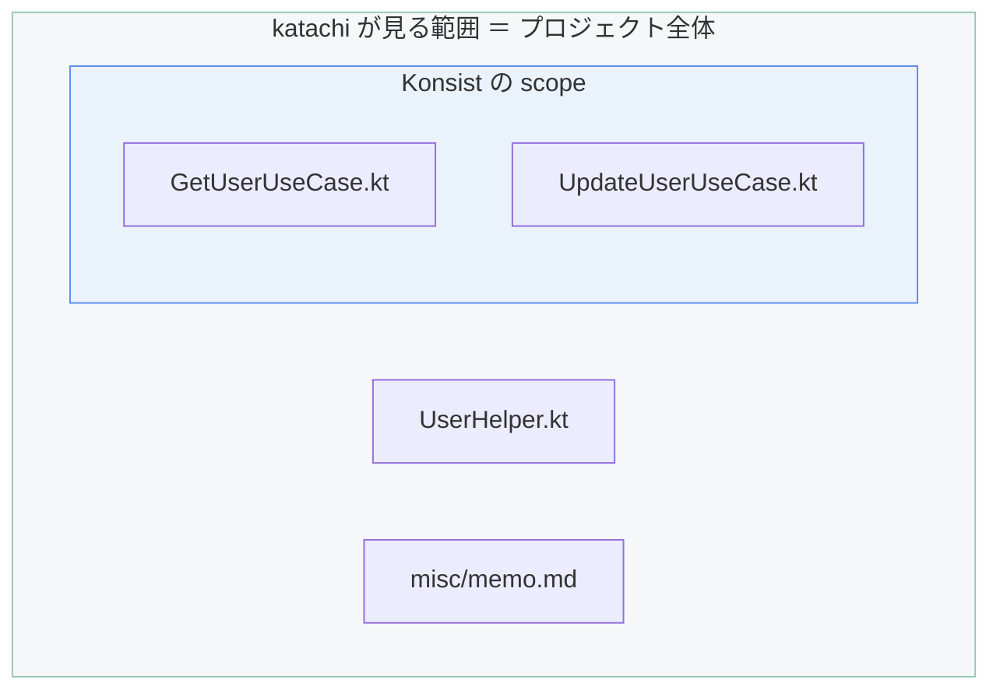
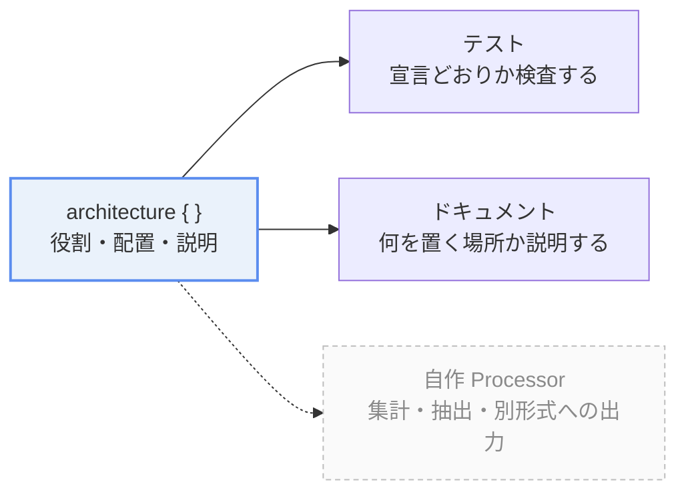

import { Aside, LinkCard, CardGrid, FileTree } from '@astrojs/starlight/components';

このページは **katachi がなぜこの形をしているのか** に答えます。
導入手順や書き方は [初めてのアーキテクチャ定義](/katachi/ja/get-started/first-architecture/) を参照してください。

## なぜ「宣言されていないファイルは違反」なのですか

アーキテクチャが壊れるとき、壊し方はたいてい **「ルールに違反するものが書かれた」ではなく
「誰も想定していない場所に何かが増えた」** です。

禁止リスト方式（「`domain` から `android.*` を import してはいけない」）は、
**思いついた禁止事項しか守れません。** 思いつかなかった壊れ方は素通りします。
そして一番多いのは、思いつかなかった壊れ方です。

違うのは**列挙し損ねたものがどちらへ倒れるか**、その1点だけです。

<details>
<summary>セキュリティ分野との邂逅</summary>

想定外の存在を怪しいと疑う考え方はセキュリティにも通ずるものがあります。

これは **fail-safe defaults**（安全側に倒れる既定値）と呼ばれ、Saltzer と Schroeder が
1975 年に挙げた設計原則の1つです。「アクセスの可否は**拒否の列挙ではなく許可の列挙**で決めよ」
というもので、ファイアウォールを default deny から書き始めるのも、
CSP を `default-src 'none'` から書き始めるのも、同じ原則の現れです。

理由も同じです。**禁止を列挙する方式は、列挙し損ねたものが素通りします。**
シグネチャ方式のマルウェア対策が未知の検体を止められないのと同じで、
**抜けたときに「静かに通る」側へ倒れます。**
許可を列挙する方式なら、抜けたときは「通らない」側へ倒れます。
どちらに倒れてほしいか、という選択です。

そして**代償も同じ**です。許可リストは列挙が大変で、運用が重い。
それでも守る価値のある境界では採用されます。katachi の「最初が重い」も同じ話です。

もっとも katachi はセキュリティのための道具ではありません。
借りているのは判断の形だけで、守っているのはアーキテクチャです。

</details>

katachi は逆に、**現れてよいものを全部書かせます。** 書いていないものは違反です。
これなら「想定していなかった」が起きません。想定していないもの自体が違反だからです。

代償は正直に言って**最初が重い**ことです。プロジェクトにあるファイルを全部説明しきるまで
テストは緑になりません。それでも、**説明しきれないファイルがあるという事実のほうが情報**だと
考えています。それは本当に要るファイルですか。

## 既存のプロジェクトに入れたら、違反だらけになりませんか

なります。**それが正常な出発点です。**

初回の実行で出てくる違反の一覧は、そのまま
**「このプロジェクトには、誰も説明できていないファイルがこれだけある」** という報告です。
katachi が壊したのではなく、もともとそうだったものが見えただけです。

出てきたパスを1つずつ、定義に足すか・移すか・消すかで片付けていくことになります。
この作業自体が、**チームがアーキテクチャについて合意し直す作業**になります。

<Aside title="既存の状態を一旦受け入れたい場合">
「今あるものは一旦そのままにして、新しく増えるものだけ止めたい」という要求は理解しています。
**baseline 機能として予定していますが、まだ実装されていません**（[ロードマップ](/katachi/ja/roadmap/)）。
現時点では `process()` で違反のリストを受け取って自分で差し引くことはできます。
</Aside>

## Konsist や ArchUnit があるのに、なぜ別のものが要るのですか

**見ている範囲が違います。**

Konsist や ArchUnit は **「対象を絞ってから、その中身を検証する」** 道具です。

```kt title="UseCaseKonsistTest.kt" {1-4}
// ここで絞る
Konsist.scopeFromProject()
    .classes()
    .withNameEndingWith("UseCase")   

    // 絞ったもののみ検証
    .assertTrue { /* ... */ }
```

この書き方では、**絞った網に引っかからないものは検証されません。**

<FileTree>
- src/main/kotlin/com/example/
  - useCase/
    - **GetUserUseCase.kt** Konsist の視界に入る
  - **UserHelper.kt** 名前が違うので視界に入らない
  - misc/
    - **memo.md** そもそもディレクトリごと視界に入らない
</FileTree>

katachi は逆向きです。**プロジェクト全体を歩いて、宣言と突き合わせます。**



「あるべきでないものがある」を見つけるには、**全体を見る側の道具**が要ります。

## では Konsist は要らなくなるのですか

いいえ、**併用します。役割が違います。**

| | 何を見るか |
|---|---|
| katachi | ファイルが**どこにあるか**。プロジェクト全体の構造 |
| Konsist | ファイルの**中身がどうあるか**。クラス・関数・可視性 |

「`UseCase` は `useCase/` ディレクトリに置く」は katachi の仕事です。
「`UseCase` は `invoke` 関数を1つだけ持つ」は Konsist の仕事です。

katachi の定義の中に Konsist の制約を書けるようにしてあるので、
**配置の違反と中身の違反が1つのレポートにまとまります。**

また Konsist の「ファイルの中身を検証する」という立ち位置は Konsist に限ったものではありません。
もしあなたが [detekt](https://detekt.dev/) のカスタムルール、[Konture](https://github.com/baole/konture) を利用している場合、検証したいルールによっては それらが Konsist の代替となるかもしれません。


<CardGrid>
  <LinkCard
    title="Konsist との統合"
    description="konsist { } の書き方と、1つのレポートにまとまる仕組み。"
    href="/katachi/ja/guides/konsist-integration/"
  />
  <LinkCard
    title="他ツールとの比較"
    description="detekt・Konture など、中身を検証する他の選択肢との関係。"
    href="/katachi/ja/get-started/comparison-with-other-tools/"
  />
</CardGrid>

## テストが1本しかないのはなぜですか

**1回走らせれば全部わかる**ようにしたいからです。

ルールごとにテストを分けると、1つ落ちた時点でそのテストは止まります。
直して再実行して、次の違反を知って、また直す。**違反の数だけ往復**が発生します。

katachi は `assert()` を1回呼ぶだけで、リポジトリ全体の違反が**1つの失敗メッセージ**に集まります。
10箇所おかしければ10箇所が一度に出ます。読むのは1回です。

```text title="1回の実行で返ってくるもの" {1}
Katachi check failed: 3 violations (Unexpected: 2, Missing: 1)

[UnexpectedFile] src/main/kotlin/com/example/GetUserUseCase.kt
  No role is defined for this file.

  Nearby locations:
    UseCase    src/main/kotlin/com/example/useCase/

  How to fix:
    - Move it to one of the locations above
    ...

[UnexpectedDirectory] src/main/kotlin/com/example/misc
  ...

[MissingFile] src/main/kotlin/com/example/useCase/DeleteUserUseCase.kt
  ...
```

1行目に**総数と内訳**があります。ここを読めば、残りを読む前に規模が分かります。

これは人間にとっても楽ですが、**AI Agent にとっては決定的**です。
1回のテスト実行で直す材料が揃うか、10回往復するかの差になります。

## テストが通るなら、ドキュメント生成は要らないのでは

**ドキュメント生成はオプション機能ですが推奨**されます。
テストは人間向けの説明ではないからです。

`assert()` が守ってくれるのは「定義どおりになっていること」だけです。
新規参画者や AI Agent が知りたいのは「**なぜ**この構造なのか」であり それはテストの出力には出てきません。

かといってドキュメントを別に書けば、**それが腐ります。** 腐ったドキュメントは
無いよりたちが悪い。実装と食い違っていることに誰も気づかないからです。

そのため katachi は**同じ定義から両方を出します**。役割に書いた `summary` や
`description` が、検査の対象であると同時にドキュメントの本文になります。



アーキテクチャ定義が Single Source of Truth となるため、**片方だけが古くなることが構造的に起きません。**

テストとドキュメントは katachi が用意しているものですが、**この2つに限りません。**
同じ定義から自分で何かを取り出すこともできます（[ArchitectureProcessor とそのカスタマイズ](/katachi/ja/guides/processor/)）。

<Aside type="caution">
ドキュメント生成は **v0.2 で予定している機能で、まだ動きません。**
現時点で使えるのは検査（`assert()`）までです。
</Aside>

## 役割の名前や粒度は、どう決めればいいのですか

**チームが今その言葉を使っているかどうか**を基準にしてください。

katachi の役割は、新しい概念を導入するためのものではありません。
すでに口頭やレビューで使われている言葉 —「これは UseCase だよね」「Repository に置いて」—
を、そのまま宣言として書き出すものです。

そのため **定義はチームの合意物**であり、重要なレビューの対象です。
AI Agent に初期の定義を作らせる場合でも、それは既存コードからの推測でしかないので、
**最終的にチームが読んで合意する**ことを前提にしています。
