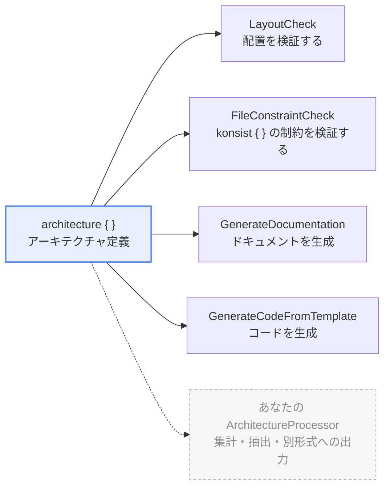

{/*
  このページの目的: アーキテクチャ定義 と ArchitectureProcessor の仕組みを理解し、独自の ArchitectureProcessor を書いて実行する方法を理解してもらう。
*/}

import { Aside, Tabs, TabItem, LinkCard } from "@astrojs/starlight/components"

このページでは、katachi の重要な構成要素の 1 つである ArchitectureProcessor を解説し、katachi への理解を一層深めることを目指します。

後半では、独自の ArchitectureProcessor を書いて実行する方法を解説します。

## ArchitectureProcessor とは

katachi の `ArchitectureProcessor` は、アーキテクチャ定義をもとに何かを行う interface です。

```kt
@ExperimentalKatachiApi
public interface ArchitectureProcessor<Args, R> {
    // 引数の parser
    public val argsSerializer: KSerializer<Args>

    // 何かを行う
    public fun process(context: ArchitectureProcessContext<Args>): Result<R>
}
```

`process` の本体は `runCatching { }` (もしくは `runCatchingScoped` ユーティリティ) で囲ってください。

| 戻り値 | 意味 | Gradle タスクでの扱い |
| --- | --- | --- |
| Result.success | run は通る | `[OK]` |
| Result.failure | run は通らない <br/> （違反が見つかった、ドキュメントが古い、処理ができなかった など） | `[FAILED]`。例外のメッセージを表示し、exit が非ゼロになる |

## katachi の 2 要素

katachi は大きく分けて、**アーキテクチャ定義** と **ArchitectureProcessor** の 2 つの要素でできています。



アーキテクチャ定義そのものは何も実行しません。**`ArchitectureProcessContext` を受け取って何かをするのが ArchitectureProcessor** です。

- アーキテクチャ定義は、プロジェクトのアーキテクチャを `architecture { }` ブロックの中に書いたものです。
- アーキテクチャを定義しただけでは何も起こりません。その定義を使って何かを行うのが ArchitectureProcessor です。

## ビルトインの ArchitectureProcessor

katachi は 5 つの ArchitectureProcessor を提供しています。

<table>
    <thead>
        <tr>
            <th>Processor</th>
            <th style="min-width: 12rem;">何を行うか？</th>
            <th style="min-width: 10rem;">ドキュメント</th>
        </tr>
    </thead>
    <tbody>
        <tr>
            <td><code>projectArchitecture.assert()</code><br />(<code>LayoutCheck</code>)</td>
            <td>ファイル配置がアーキテクチャ定義に沿っているかを検証し、エラーがあればアサーション例外を発生させます。</td>
            <td></td>
        </tr>
        <tr>
            <td><code>FileConstraintCheck</code></td>
            <td><code>{"konsist { }"}</code> に書かれた制約を評価します。<code>projectArchitecture.assert(FileConstraintCheck())</code> のように渡します。</td>
            <td><a href="/katachi/ja/guides/konsist-integration/">Konsist との統合</a></td>
        </tr>
        <tr>
            <td><code>GenerateDocumentation</code></td>
            <td>プロジェクト定義に書かれた summary, description などのプロパティをもとにドキュメントを生成します。</td>
            <td><a href="/katachi/ja/guides/document-generation/">ドキュメント生成</a></td>
        </tr>
        <tr>
            <td><code>GenerateCodeFromTemplate</code></td>
            <td>プロジェクト定義内の <code>{"template { }"}</code> ブロックの内容をもとにファイルを生成します。</td>
            <td><a href="/katachi/ja/guides/generate-code-from-template/">テンプレートからのコード生成</a></td>
        </tr>
        <tr>
            <td><code>DescribeTemplates</code></td>
            <td><code>{"template { }"}</code> を持つ役割の一覧や、1つのテンプレートのパラメータと生成されるファイルを表示します。ファイルは書きません。</td>
            <td><a href="/katachi/ja/guides/generate-code-from-template/">テンプレートからのコード生成</a></td>
        </tr>
    </tbody>
</table>

いずれもプロジェクトのアーキテクチャ定義を受け取り、それを検証や生成のために使用しています。

## ArchitectureProcessor の実行

ArchitectureProcessor の実行方法にはいくつかのパターンがあります。

推奨される実行方法は ArchitectureProcessor ごとに異なります。個々の実行方法は、それぞれのドキュメントを参照してください。

<Tabs>
    <TabItem label="API をプログラムから呼び出す">

ArchitectureProcessor に API（多くの場合トップレベル関数）が用意されていれば、その API を呼び出して ArchitectureProcessor を実行できます。

例えば LayoutCheck なら、`projectArchitecture.assert()` を呼び出すと実行できます。

```kt
projectArchitecture.assert() // 内部で LayoutCheck().process(...) を呼び出す
```

    </TabItem>
    <TabItem label="コマンドラインから実行する">

コマンドラインから実行するには、ArchitectureProcessor を Gradle plugin に登録しておく必要があります。

```kts title="architecture-test/build.gradle.kts" {5-6}
katachi {
    processors {
        // ...

        // ⭐️ ArchitectureProcessor 名 と 対応するクラス名を指定する
        register("someProcessor", "com.example.SomeProcessor")
    }
}
```

また、登録と同時にデフォルト値を設定することもできます。

```kts title="architecture-test/build.gradle.kts"
katachi {
    processors {
        // 登録と同時に既定値を書く
        register("someProcessor", "com.example.SomeProcessor") {
            arg("someArg1", "someValue1")
        }

        // 既に登録されている processor に既定値だけ足す
        args("docs") {
            arg("mode", "check")
        }
    }
}
```

登録した processor ごとに Gradle タスクが用意されます。
タスク名は `katachi` + 登録キーの先頭を大文字にしたものです（例: `register("someProcessor", ...)` → `katachiSomeProcessor`）。

実行例:

```
$ ./gradlew katachiSomeProcessor
[1/3] Processors: someProcessor

[2/3] Processing...

========================================
[3/3] Katachi processor run: 1 succeeded, 0 failed

[OK] someProcessor

========================================
```

`process` の `runCatching { }` の中で例外が投げられると、表示は `[FAILED] docs` になり、`1 succeeded, 0 failed` の数も変わって、タスクの exit が非ゼロになります。processor の戻り値が `Collection` の場合は 1 要素 1 行で出力されます。

    </TabItem>
</Tabs>

---

## カスタムの ArchitectureProcessor

ArchitectureProcessor は単純な interface なので、自分で実装して自由に処理を追加できます。

<Aside>

    GitHub リポジトリの sample/custom-processor モジュールに、カスタム ArchitectureProcessor の例があります。

    <LinkCard title="sample/custom-processor" description="引数なし・引数あり・検査する processor の 3 本と、その登録" href="https://github.com/TBSten/katachi/tree/main/sample/custom-processor" />

</Aside>

### 1. ArchitectureProcessor を実装する

ArchitectureProcessorNoArg か ArchitectureProcessor を実装したクラスを用意し、process メソッドを実装してください。

process メソッドに渡される `context` には、アーキテクチャ定義や引数などが入っています。これらを必要に応じて参照しながら、ArchitectureProcessor のロジックを書きます。

<Tabs>
    <TabItem label="引数なし">
        ```kt {3,4}
        // ArchitectureProcessorNoArg を実装した object を定義
        @OptIn(ExperimentalKatachiApi::class)
        object CountFilesPerRole : ArchitectureProcessorNoArg<Map<String, Int>> {
            override fun process(context: ArchitectureProcessNoArgContext): Result<Map<String, Int>> = runCatching {
                // context.architecture    ... アーキテクチャ定義
                // context.roles / groups  ... 定義された役割・group
                // context.declaredEntries ... layout を flat にした宣言の一覧
                // context.filesOf(role)   ... その役割にマッチした実ファイル
                // context.rawArgs         ... 渡された引数（名前と値）をそのまま
                // context.log()           ... 進捗を表示します

                context.log("Counting files per role...")
                context.roles.associate { role -> role.name to context.filesOf(role).size }
            }
        }
        ```
    
    </TabItem>
    <TabItem label="引数あり">
        katachi は引数のパースに [kotlinx.serialization](https://github.com/kotlin/kotlinx.serialization) を利用するため プロジェクトに kotlinx.serialization の依存を追加してください。

        ```kts {3} title="architecture-test/build.gradle.kts" 
        plugins {
            kotlin("jvm") version "<kotlin-version>"
            kotlin("plugin.serialization") version "<kotlin-version>"
        }
        ```        

        ```kt {2, 4, 6, 17-18} nocollapse
        @OptIn(ExperimentalKatachiApi::class)
        object CountFilesPerRole : ArchitectureProcessor<CountFilesPerRole.Args, Map<String, Int>> {
            // --arg で受け取る値の型と、その読み方を渡します
            override val argsSerializer: KSerializer<Args> = Args.serializer()

            override fun process(context: ArchitectureProcessContext<Args>): Result<Map<String, Int>> = runCatching {
                // context.args を使って引数を参照する
                val args: CountFilesPerRole.Args = context.args
                val prefix = args.prefix

                context.log("Counting files per role under $prefix...")
                context.roles
                    .filter { role -> role.qualifiedName.startsWith(prefix) }
                    .associate { role -> role.name to context.filesOf(role).size }
            }

            @Serializable
            data class Args(val prefix: String = "")
        }
        ```

    </TabItem>
</Tabs>

`context` から取得できる情報の詳細は [`ArchitectureProcessContext` の API リファレンス](/katachi/api-docs/katachi/me.tbsten.katachi.processor/-architecture-process-context/index.html) を参照してください。


<details>
<summary>Role の metadata</summary>

場合によっては、ArchitectureProcessor の側で、アーキテクチャ定義に独自のプロパティを指定してほしくなるかもしれません。
その場合は **Role の metadata** を使えます。

例えば、すでに非推奨なのに過去の遺産として残ってしまっている Role を Obsolete としてマークしたいなら、以下のように Obsolete という metadata を定義して設定できます。

```kt nocollapse
// metadata のキー
@OptIn(ExperimentalKatachiApi::class)
val Obsolete: MetadataKey<Boolean> = metadata()

@OptIn(ExperimentalKatachiApi::class)
var MetadataScope.obsolete: Boolean? by Obsolete

// Processor 側
@OptIn(ExperimentalKatachiApi::class)
object ObsoleteRoles : ArchitectureProcessorNoArg<List<String>> {
    override fun process(context: ArchitectureProcessNoArgContext): Result<List<String>> = runCatching {
        context.roles.filter { it[Obsolete] == true }.map { it.name }
    }
}

// 利用側
architecture {
   "UseCase" {
      obsolete = true
   }
}
```

`metadata<T>()` と `MetadataKey` は `@ExperimentalKatachiApi` です。書いていない metadata は **既定値を持たず「無い」** ので、読む側が「無いときどうするか」を決めます。

</details>

### 2. ArchitectureProcessor を実行する方法を用意する

利用者が ArchitectureProcessor を実行する方法を用意してください。

プログラムから実行したいなら API を用意する方法を、ワンショットで実行したいならコマンドラインから実行する方法をおすすめします。

<Tabs>
    <TabItem label="API を用意する">

        `Architecture` の拡張関数を用意します。katachi が `assert()` を用意しているのと同じ形です。

        ```kt
        @OptIn(ExperimentalKatachiApi::class)
        fun Architecture.countFilesPerRole(): Map<String, Int> = process(CountFilesPerRole, CountFilesPerRole.Args()).getOrThrow()
        ```

        利用者は processor の存在を知らず用意された API を呼び出すことができます。

        ```kt
        val counts = projectArchitecture.countFilesPerRole()
        ```

    </TabItem>

    <TabItem label="Gradle タスクから実行する">

        `katachi.processors.register` に登録すると、登録したキーから決まる名前の Gradle タスクとして呼べるようになります。
        
        （例: `countFilesPerRole` → `katachiCountFilesPerRole`）

        ```kts title="architecture-test/build.gradle.kts"
        katachi {
            processors {
                register("countFilesPerRole", "com.example.processors.CountFilesPerRole")
            }
        }
        ```

        ```shell
        ./gradlew katachiCountFilesPerRole
        ```

        <details>
            <summary>`--arg` の値の読まれ方</summary>

            `--arg` の値は文字列として渡り、`Args` のフィールドの型に合わせて読まれます。

            | フィールドの型 | 渡し方 |
            | --- | --- |
            | `String` | そのまま入ります。カンマも分割されず `--arg a=x,y` は `"x,y"` になります |
            | `Int` `Long` `Boolean` など | 文字列から読みます。`--arg count=2` `--arg dryRun=true` |
            | `List<String>` `Set<String>` | **カンマで分割されます。**`--arg groups=core,testing` |
            | `enum` | 項目の名前で渡します（`@SerialName` を付けていればその名前）。大文字小文字も一致させてください |
            | `Map`、ネストした `@Serializable` | 対応していません |

        </details>

    </TabItem>
</Tabs>

---

用意した実行方法は **processor の KDoc に書くなど ドキュメンテーションとして用意して利用者に実行方法まで含めて伝えるようにしてください**。

## まとめ

- **`assert()` もドキュメント・テンプレート生成も ArchitectureProcessor** です。
- 同じ仕組みに乗せて、カスタムの ArchitectureProcessor を作ることができます。

## 次のステップ

- [ドキュメント生成](/katachi/ja/guides/document-generation/) ... 同じ仕組みに乗っている、いちばん大きなビルトイン processor です。
- [テンプレートからコード生成](/katachi/ja/guides/generate-code-from-template/) ... 定義からコードを出す processor です。
