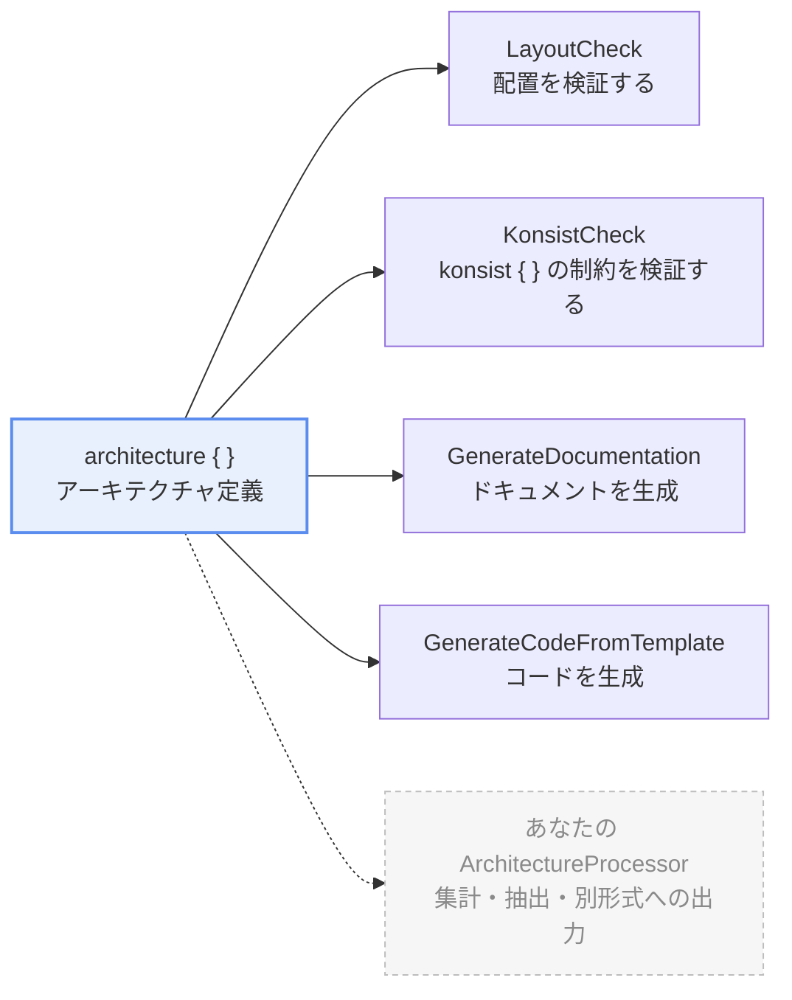

import { Aside, Tabs, TabItem, LinkCard } from "@astrojs/starlight/components"

このページでは katachi の重要な要素の 1つである ArchitectureProcessor について解説することで katachi への理解を一層深めることを目指します。

後半では独自の ArchitectureProcessor を書いて実行する方法について解説します。

## ArchitectureProcessor とは

katachi の `ArchitectureProcessor` クラスはアーキテクチャ定義を元に 何かを行う interface です。

```kt
public interface ArchitectureProcessor<Args, R> {
    public val argsSerializer: KSerializer<Args>
    public fun process(context: ArchitectureProcessContext<Args>): Result<R>
}
```

`process` の本体は `runCatching { }` で包みます。**「この run は通らない」と答えるときは、その中で例外を投げます。**`Result.success` / `Result.failure` を手で組み立てる必要はありません。

| `runCatching { }` の中で | 意味 | `runKatachiProcessor` での扱い |
| --- | --- | --- |
| 最後まで進んで値を返す | run は通る | `[OK]` |
| 例外を投げる | run は通らない（違反が見つかった、ドキュメントが古い、処理ができなかった など） | `[FAILED]`。例外のメッセージを表示し、exit が非ゼロになる |

違反の一覧を返す検査は、最後に `assertNoErrors()` を呼びます。`Severity.Error` の違反があれば `KatachiArchitectureAssertionError` を投げ、Warning だけならそのまま返します。`assert()` はこの例外を「違反を見つけた」として1つのレポートにまとめ、それ以外の例外は「その検査は答えられなかった」（`[UncheckedCheck]`）として扱います。`LayoutCheck` と `KonsistCheck` もこの形で書かれています。

引数を取らない ArchitectureProcessor は `ArchitectureProcessorNoArg<R>` を実装します。`argsSerializer` の記述を肩代わりするだけの薄い interface です。

```kt
public interface ArchitectureProcessorNoArg<R> : ArchitectureProcessor<Unit, R>
```

## katachi の 2 要素

katachi は 大きく分けて **アーキテクチャ定義** と **ArchitectureProcessor** の2つの要素から成ります。



アーキテクチャ定義そのものは何も実行しません。**`ArchitectureProcessContext` を受け取って何かをするのが ArchitectureProcessor** です。

- アーキテクチャ定義は `architecture { }` ブロックの中で記載するプロジェクトのアーキテクチャの定義です。
- アーキテクチャを定義しただけでは何も起こりません。それを利用して何かを行うのが ArchitectureProcessor です。

## ビルトインの ArchitectureProcessor

katachi は 4 つの ArchitectureProcessor を提供しています。

<table>
    <thead>
        <tr>
            <th>Processor</th>
            <th>何を行うか？</th>
            <th>ドキュメント</th>
        </tr>
    </thead>
    <tbody>
        <tr>
            <td><code>projectArchitecture.assert()</code><br />(<code>LayoutCheck</code>)</td>
            <td>アーキテクチャ定義に沿ったファイル配置になっているかを検証して エラーがある場合はアサーション例外を発生させます。</td>
            <td></td>
        </tr>
        <tr>
            <td><code>KonsistCheck</code></td>
            <td><code>{"konsist { }"}</code> に書かれた制約を評価します。<code>projectArchitecture.assert(KonsistCheck())</code> のように渡します。</td>
            <td><a href="/katachi/ja/guides/konsist-integration/">Konsist との統合</a></td>
        </tr>
        <tr>
            <td><code>GenerateDocumentation</code></td>
            <td>プロジェクト定義に書かれた summary, description などのプロパティをもとにドキュメントを生成します。</td>
            <td><a href="/katachi/ja/guides/document-generation/">ドキュメント生成</a></td>
        </tr>
        <tr>
            <td><code>GenerateCodeFromTemplate</code></td>
            <td>プロジェクト定義内の <code>{"template { }"}</code> ブロックの内容をもとにファイルを生成します。</td>
            <td><a href="/katachi/ja/guides/generate-code-from-template/">テンプレートからのコード生成</a></td>
        </tr>
    </tbody>
</table>

いずれも プロジェクトのアーキテクチャ定義を受け取り、それらを何かしらの生成に役立てています。

## ArchitectureProcessor の実行

ArchitectureProcessor を実行する方法のパターンがいくつかあります。

ArchitectureProcessor ごとに推奨される実行方法は異なるため、個々の ArchitectureProcessor の実行方法についてはそれぞれのドキュメントを参照してください。

<Tabs>
    <TabItem label="API をプログラムから呼び出す">

ArchitectureProcessor とともに用意されている API （多くの場合トップレベル関数）がある場合、その API を呼び出すことで ArchitectureProcessor を実行できます。

例えば LayoutCheck であれば `projectArchitecture.assert()` を呼び出すことでその ArchitectureProcessor を実行できます。

```kt
projectArchitecture.assert() // 内部で LayoutCheck().process(...) を呼び出す
```

    </TabItem>
    <TabItem label="コマンドラインから実行する">

コマンドラインから ArchitectureProcessor を実行するには Gradle plugin を通じて 登録されている必要があります。

```kts title="architecture-test/build.gradle.kts" {5-6}
katachi {
    processors {
        // ...

        // ⭐️ ArchitectureProcessor 名 と 対応するクラス名を指定する
        register("someProcessor", "com.example.SomeProcessor")
    }
}
```

毎回同じ引数を渡すなら、**そのモジュールの既定値としてビルドファイルに1度だけ書けます。** コマンドラインの `--arg` のほうが強いので、1回だけ変えたいときにビルドファイルを触る必要はありません。

```kts title="architecture-test/build.gradle.kts"
katachi {
    processors {
        // 登録と同時に既定値を書く
        register("someProcessor", "com.example.SomeProcessor") {
            arg("someArg1", "someValue1")
        }

        // 既に登録されているキーに既定値だけ足す
        args("docs") {
            arg("mode", "check")
        }
    }
}
```

katachi 自身の 2 つには**型のついた block** が用意されています。引数名が katachi の公開面の一部になるので、打ち間違いがビルド時に分かります。

```kts title="architecture-test/build.gradle.kts"
katachi {
    processors {
        docs {
            outputDir = rootProject.layout.projectDirectory.dir("docs")
        }
    }
}
```

<Aside type="caution">
同じキーを `docs { }` と `args("docs") { }` の両方で設定するとビルドが落ちます。同じ processor を指す 2 つの綴りなので、どちらか一方に寄せてください。
</Aside>

<details>
    <summary>デフォルトで登録されている ArchitectureProcessor</summary>

    `docs` (ドキュメント生成) と `template` (テンプレートからのコード生成) は一般的なユースケースであるためデフォルトで登録されています。
    これらの ArchitectureProcessor を実行するために `katachi.processors` に登録する必要はありません。

    同じキーを自分で `register` すると**そちらが勝ちます。** `docs` を自作の processor に差し替えることもできます。

    ```kts title="architecture-test/build.gradle.kts" {5-7}
    katachi {
        architecture = "com.example.projectArchitecture"

        processors {
            // ⭐️ これらは不要です
            register("docs", "me.tbsten.katachi.docs.GenerateDocumentation")
            register("template", "me.tbsten.katachi.template.GenerateCodeFromTemplate")
        }
    }
    ```

</details>

katachi gradle plugin には ArchitectureProcessor を実行するための `runKatachiProcessor` Gradle タスクが用意されているため、これを実行することで ArchitectureProcessor を実行できます。

```shell
# GenerateCodeFromTemplate を実行する例 

# runKatachiProcessor task を実行します
./gradlew runKatachiProcessor \
  # 実行したい ArchitectureProcessor 名を指定
  --processor='someProcessor' \
  # --arg で ArchitectureProcessor に渡す引数を指定
  --arg "someArg1=someValue1" --arg "someArg2=someValue2"
```

実行例:

```
[1/3] Processors: docs

[2/3] Processing...
  [docs] Writing 17 pages to /path/to/sample/jvm/docs
  [docs] README.md
  [docs] api/
  [docs]   README.md
  [docs]   Controller.md
  [docs] domain/
  [docs]   README.md
  [docs]   Service.md

========================================
[3/3] Katachi processor run: 1 succeeded, 0 failed

[OK] docs

========================================
```

`process` の `runCatching { }` の中で例外が投げられると `[FAILED] docs` になり、`1 succeeded, 0 failed` の数が変わって、タスクの exit が非ゼロになります。processor の戻り値が `Collection` の場合は 1 要素 1 行で出力されます。

    </TabItem>
</Tabs>

---

## カスタムの ArchitectureProcessor

ArchitectureProcessor は単純な interface として提供されているため あなたが独自に実装して自由に処理を追加することが可能です。

<Aside>

Github リポジトリの sample/custom-processor モジュールにカスタム ArchitectureProcessor の例があります。

<LinkCard title="sample/custom-processor" description="引数なし・引数あり・検査する processor の 3 本と、その登録" href="https://github.com/TBSten/katachi/tree/main/sample/custom-processor" />

</Aside>

### 1. ArchitectureProcessor を実装する

ArchitectureProcessorNoArg や ArchitectureProcessor を実装したクラスを用意して process メソッドを実装してください。

process メソッドの引数に渡される `context` には アーキテクチャ定義や引数などが格納されているためこれらを適宜参照して ArchitectureProcessor のロジックを実装します。

<Tabs>
    <TabItem label="引数なし">
        ```kt {2,3}
        // ArchitectureProcessorNoArg を実装した object を定義
        object CountFilesPerRole : ArchitectureProcessorNoArg<Map<String, Int>> {
            override fun process(context: ArchitectureProcessContext<Unit>): Result<Map<String, Int>> = runCatching {
                // context.architecture    ... アーキテクチャ定義
                // context.roles / groups  ... 定義された役割・group
                // context.declaredEntries ... layout を flat にした宣言の一覧
                // context.filesOf(role)   ... その役割にマッチした実ファイル
                // context.fileSystem      ... 走査に使うファイルシステム
                // context.log()           ... 進捗を表示します

                context.log("Counting files per role...")
                context.roles.associate { role -> role.name to context.filesOf(role).size }
            }
        }
        ```
    
    </TabItem>
    <TabItem label="引数あり">
        引数を受け取る必要がある ArchitectureProcessor を作成する場合、引数のパース処理に [kotlinx.serialization](https://github.com/kotlin/kotlinx.serialization) を利用します。

        ```kts {3, 7} title="architecture-test/build.gradle.kts" 
        plugins {
            kotlin("jvm") version "<kotlin-version>"
            kotlin("plugin.serialization") version "<kotlin-version>"
        }

        dependencies {
            implementation("org.jetbrains.kotlinx:kotlinx-serialization-core:<serialization-version>")
        }
        ```        

        ```kt {1, 3, 5, 17} nocollapse
        object CountFilesPerRole : ArchitectureProcessor<CountFilesPerRole.Args, Map<String, Int>> {
            // --arg で受け取る値の型と、その読み方を渡します
            override val argsSerializer: KSerializer<Args> = Args.serializer()

            override fun process(context: ArchitectureProcessContext<Args>): Result<Map<String, Int>> = runCatching {
                // context.args を使って引数を参照する
                val args: CountFilesPerRole.Args = context.args
                val prefix = args.prefix

                context.log("Counting files per role under $prefix...")
                context.roles
                    .filter { role -> role.qualifiedName.startsWith(prefix) }
                    .associate { role -> role.name to context.filesOf(role).size }
            }

            @Serializable
            data class Args(val prefix: String = "")
        }
        ```

    </TabItem>
</Tabs>

`context` から取得できる情報の詳細は [`ArchitectureProcessContext` の API リファレンス](/katachi/api-docs/katachi/me.tbsten.katachi.processor/-architecture-process-context/index.html) を参照してください。


<details>
<summary>Role の metadata</summary>

場合によっては ArchitectureProcessor 利用側でアーキテクチャ定義に指定してほしい独自のプロパティが必要になるかもしれません。
その場合は **Role の metadata** を利用することができます。

例えばすでに非推奨になったものの過去の遺産として残ってしまっている Role を Deprecated としてマークしたい場合、以下のように Deprecated という metadata を定義して設定することができます。

```kt nocollapse
// metadata のキー
@OptIn(ExperimentalKatachiApi::class)
val Obsolete: MetadataKey<Boolean> = metadata()

@OptIn(ExperimentalKatachiApi::class)
var MetadataScope.obsolete: Boolean? by Obsolete

// Processor 側
object ObsoleteRoles : ArchitectureProcessorNoArg<List<String>> {
    override fun process(context: ArchitectureProcessContext<Unit>): Result<List<String>> = runCatching {
        context.roles.filter { it[Obsolete] == true }.map { it.name }
    }
}

// 利用側
architecture {
   "UseCase" {
      obsolete = true
   }
}
```

`metadata<T>()` と `MetadataKey` は `@ExperimentalKatachiApi` です。書いていない metadata は **既定値を持たず「無い」** ので、読む側が「無いときどうするか」を決めます。

</details>

### 2. ArchitectureProcessor を実行する方法を用意する

利用者が ArchitectureProcessor を実行する方法を用意してください。

API としてプログラムから実行したい場合は API を用意する方法が、ワンショットで実行したい場合は コマンドラインから実行する方法が推奨されます。

<Tabs>
    <TabItem label="API を用意する">

        `Architecture` の拡張関数を用意します。katachi が `assert()` を用意しているのと同じ形です。

        ```kt
        // CountFilesPerRole と同じファイルに置く
        @OptIn(ExperimentalKatachiApi::class)
        fun Architecture.countFilesPerRole(): Map<String, Int> = process(CountFilesPerRole).getOrThrow()
        ```

        利用者は processor の存在を知らずに済みます。

        ```kt
        val counts = projectArchitecture.countFilesPerRole()
        ```

    </TabItem>
    <TabItem label="Gradle タスクから実行する">

        `katachi.processors.register` に登録すると、`runKatachiProcessor` から名前で呼べるようになります。

        ```kts title="architecture-test/build.gradle.kts"
        katachi {
            processors {
                register("countFilesPerRole", "com.example.processors.CountFilesPerRole")
            }
        }
        ```

        ```shell
        ./gradlew runKatachiProcessor --processor=countFilesPerRole
        ```

        `--arg` で引数を受け取りたい場合は、`@Serializable` なクラスを `Args` として宣言し、`argsSerializer` を返します。`ArchitectureProcessorNoArg` ではなく `ArchitectureProcessor<Args, R>` を実装してください。

        ```kt
        @OptIn(ExperimentalKatachiApi::class)
        object RoleNames : ArchitectureProcessor<RoleNames.Args, List<String>> {
            override val argsSerializer: KSerializer<Args> = Args.serializer()

            override fun process(context: ArchitectureProcessContext<Args>): Result<List<String>> = runCatching {
                context.log("Listing roles with prefix=${context.args.prefix}")
                context.roles.map { it.qualifiedName }.filter { it.startsWith(context.args.prefix) }
            }

            @Serializable
            data class Args(val prefix: String = "")
        }
        ```

        ```shell
        ./gradlew runKatachiProcessor --processor=roleNames --arg prefix=domain/
        ```

        `Args` を持つと、そのモジュールに `kotlin("plugin.serialization")` が必要になります。引数を取らない processor には要りません。

        <details>
            <summary>--arg の値の読まれ方</summary>

            `--arg` の値は文字列として渡り、`Args` のフィールドの型に合わせて読まれます。

            | フィールドの型 | 渡し方 |
            | --- | --- |
            | `String` | そのまま入ります。カンマも分割されず `--arg a=x,y` は `"x,y"` になります |
            | `Int` `Long` `Boolean` など | 文字列から読みます。`--arg count=2` `--arg dryRun=true` |
            | `List<String>` `Set<String>` | **カンマで分割されます。**`--arg groups=core,testing` |
            | `enum` | 項目の名前で渡します（`@SerialName` を付けていればその名前）。大文字小文字も一致させてください |
            | `Map`、ネストした `@Serializable` | 対応していません |

            **`Args` に宣言していない名前を `--arg` で渡すと、その場で落ちます。** 打ち間違えた引数が、既定値のまま黙って走ってしまうのを防ぐためです。役割ごとに引数名が変わるような processor は `undeclaredArgNames()` でその run が受け付ける名前を答えます。

        </details>

    </TabItem>
</Tabs>

用意した実行方法は **processor の KDoc に書いてください。** 利用者が最初に読むのはクラスの KDoc で、「どう呼ぶか」がそこに無いと、このページまで戻ってこないといけません。`## Example` としてコード例を置くのが katachi の書き方です。

## まとめ

- **`assert()` もドキュメント・テンプレート生成も ArchitectureProcessor** です。
- 同じ仕組みに乗っかってカスタムの ArchitectureProcessor を作ることもできます。

## 次のステップ

- [ドキュメント生成](/katachi/ja/guides/document-generation/) ... 同じ仕組みに乗っている、いちばん大きなビルトイン processor です。
- [テンプレートからコード生成](/katachi/ja/guides/generate-code-from-template/) ... 定義からコードを出すほうの processor です。
- [ロードマップ](/katachi/ja/roadmap/) ... この先どの機能がどのバージョンで来るのかを確かめましょう。
