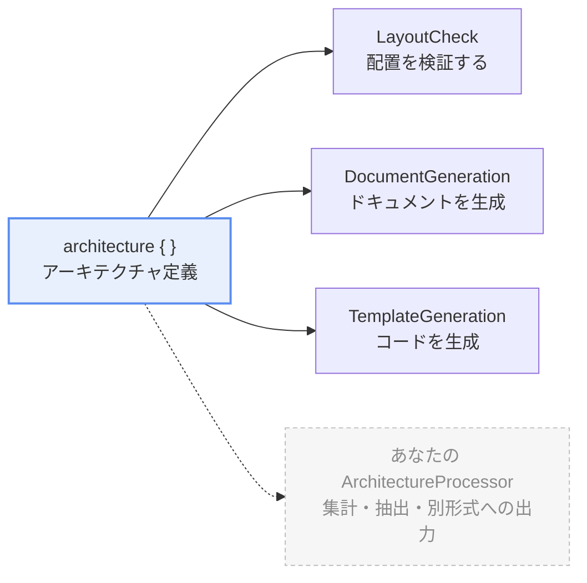

import { Aside, Tabs, TabItem } from "@astrojs/starlight/components"

このページでは katachi の重要な要素の 1つである ArchitectureProcessor について解説することで katachi への理解を一層深めることを目指します。

後半では独自の ArchitectureProcessor を書いて実行する方法について解説します。

## ArchitectureProcessor とは

katachi の `ArchitectureProcessor` クラスはアーキテクチャ定義を元に 何かを行う interface です。

```kt
public interface ArchitectureProcessor<Args, Result> {
    public val argsSerializer: KSerializer<Args>
    public fun process(context: ArchitectureProcessContext<Args>): Result
}
```

引数を取らない ArchitectureProcessor は `ArchitectureProcessorNoArg<Result>` を実装します。`argsSerializer` の記述を肩代わりするだけの薄い interface です。

```kt
public interface ArchitectureProcessorNoArg<Result> : ArchitectureProcessor<Unit, Result>
```

## katachi の 2 要素

katachi は 大きく分けて **アーキテクチャ定義** と **ArchitectureProcessor** の2つの要素から成ります。

{/* TODO 図も修正しないといけない */}


アーキテクチャ定義そのものは何も実行しません。**`ArchitectureProcessContext` を受け取って何かをするのが ArchitectureProcessor** です。

- アーキテクチャ定義は `architecture { }` ブロックの中で記載するプロジェクトのアーキテクチャの定義です。
- アーキテクチャを定義しただけでは何も起こりません。それを利用して何かを行うのが ArchitectureProcessor です。

## ビルトインの ArchitectureProcessor

katachi はデフォルトで 3 つの ArchitectureProcessor を提供しています。

| Processor | 何を行うか？ | ドキュメント |
| --- | --- | --- |
| `projectArchitecture.assert()` (`LayoutCheck`) | アーキテクチャ定義に沿ったファイル配置になっているかを検証して エラーがある場合はアサーション例外を発生させます。 |  |
| `GenerateDocumentation` | プロジェクト定義に書かれた summary, description などのプロパティをもとにドキュメントを生成します。 | [ドキュメント生成](/katachi/ja/guides/document-generation/) |
| `GenerateCodeFromTemplate` | プロジェクト定義内の `template { }` ブロックの内容をもとにファイルを生成します。 | [テンプレートからのコード生成](/katachi/ja/guides/generate-code-from-template/) |

いずれも プロジェクトのアーキテクチャ定義を受け取り、それらを何かしらの生成に役立てています。

## ArchitectureProcessor の実行

ArchitectureProcessor を実行する方法のパターンがいくつかあります。

ArchitectureProcessor ごとに推奨される実行方法は異なるため、個々の ArchitectureProcessor の実行方法についてはそれぞれのドキュメントを参照してください。

### 実行方法1. 用意されている API をプログラムから呼び出す

ArchitectureProcessor とともに用意されている API （多くの場合トップレベル関数）がある場合、その API を呼び出すことで ArchitectureProcessor を実行できます。

例えば LayoutCheck であれば `projectArchitecture.assert()` を呼び出すことでその ArchitectureProcessor を実行できます。

```kt
projectArchitecture.assert() // 内部で LayoutCheck().process(...) を呼び出す
```

### 実行方法2. コマンドラインから実行する

コマンドラインから ArchitectureProcessor を実行するには Gradle plugin を通じて 登録されている必要があります。

```kts title="architecture-test/build.gradle.kts" {5-6}
katachi {
    processors {
        // ...

        // ⭐️ ArchitectureProcessor 名 と 対応するクラス名を指定する
        register("someProcessor", "com.example.SomeProcessor")
    }
}
```

<details>
    <summary>デフォルトで登録されている ArchitectureProcessor</summary>

    `docs` (ドキュメント生成) と `template` (テンプレートからのコード生成) は一般的なユースケースであるためデフォルトで登録されています。
    これらの ArchitectureProcessor を実行するために `katachi.processors` に登録する必要はありません。

    ```kts title="architecture-test/build.gradle.kts" {5-7}
    katachi {
        architecture = "com.example.projectArchitecture"

        processors {
            // ⭐️ これらは不要です
            register("docs", "me.tbsten.katachi.docs.GenerateDocumentation")
            register("template", "me.tbsten.katachi.template.GenerateCodeFromTemplate")
        }
    }
    ```

</details>

katachi gradle plugin には ArchitectureProcessor を実行するための `runKatachiProcessor` Gradle タスクが用意されているため、これを実行することで ArchitectureProcessor を実行できます。

```shell
# GenerateCodeFromTemplate を実行する例 

# runKatachiProcessor task を実行します
./gradlew runKatachiProcessor \
  # 実行したい ArchitectureProcessor 名を指定
  --processor='someProcessor' \
  # --arg で ArchitectureProcessor に渡す引数を指定
  --arg "someArg1=someValue1" --arg "someArg2=someValue2"
```

実行例:

```
TODO
```

---

## カスタムの ArchitectureProcessor

ArchitectureProcessor は単純な interface として提供されているため あなたが独自に実装して自由に処理を追加することが可能です。

### 1. ArchitectureProcessor を実装する

ArchitectureProcessor を実装したクラスを用意して process メソッドを実装してください。

process メソッドの引数に渡される `context` には アーキテクチャ定義や引数などが格納されているためこれらを適宜参照して ArchitectureProcessor のロジックを実装します。

```kt
object CountFilesPerRole : ArchitectureProcessorNoArg<Map<String, Int>> {
    override fun process(context: ArchitectureProcessContext<Unit>): Map<String, Int> {
        // context.architecture    ... アーキテクチャ定義そのもの
        // context.roles / groups  ... 定義された役割・group
        // context.declaredEntries ... layout を平坦化した宣言の一覧
        // context.filesOf(role)   ... その役割にマッチした実ファイル
        // context.args            ... CLI から --arg で渡された引数（引数なしなら Unit）
        // context.fileSystem      ... 走査に使うファイルシステム
        // context.log()           ... 進捗を出します

        context.log("Counting files per role...")
        return context.roles.associate { role -> role.name to context.filesOf(role).size }
    }
}
```

<Aside type="tip">
走査は Context の中で**1回しか起きません**。`roles` も `filesOf()` も同じ結果を読むので、何度呼んでもファイルツリーを読み直すことはありません。
</Aside>

{/* TODO: API リファレンスが出たら `ArchitectureProcessContext` へリンクする */}
`context` から取得できる情報の詳細は `ArchitectureProcessContext` の API ドキュメントを参照してください。

<details>
<summary>Role の metadata</summary>

場合によっては ArchitectureProcessor 利用側でアーキテクチャ定義に指定してほしい独自のプロパティが必要になるかもしれません。
その場合は **Role の metadata** を利用することができます。

例えばすでに非推奨になったものの過去の遺産として残ってしまっている Role を Deprecated としてマークしたい場合、以下のように Deprecated という metadata を定義して設定することができます。

```kt nocollapse
// metadata のキー。`Deprecated` は kotlin.Deprecated とぶつかるので避けます
@OptIn(ExperimentalKatachiApi::class)
val Obsolete: MetadataKey<Boolean> = metadata()

@OptIn(ExperimentalKatachiApi::class)
var MetadataScope.obsolete: Boolean? by Obsolete

// Processor 側
object ObsoleteRoles : ArchitectureProcessorNoArg<List<String>> {
    override fun process(context: ArchitectureProcessContext<Unit>): List<String> =
        context.roles.filter { it[Obsolete] == true }.map { it.name }
}

// 利用側
architecture {
   "UseCase" {
      obsolete = true
   }
}
```

`metadata<T>()` と `MetadataKey` は `@ExperimentalKatachiApi` です。書いていない metadata は**既定値を持たず「無い」**ので、読む側が「無いときどうするか」を決めます。

</details>

### 2. ArchitectureProcessor を実行する方法を用意する

利用者が ArchitectureProcessor を実行する方法を用意してください。

API としてプログラムから実行したい場合は API を用意する方法が、ワンショットで実行したい場合は コマンドラインから実行する方法が推奨されます。

<Tabs>
    <TabItem label="API を用意する">

        `Architecture` の拡張関数を用意します。katachi が `assert()` を用意しているのと同じ形です。

        ```kt
        // CountFilesPerRole と同じファイルに置く
        @OptIn(ExperimentalKatachiApi::class)
        fun Architecture.countFilesPerRole(): Map<String, Int> = process(CountFilesPerRole)
        ```

        利用者は processor の存在を知らずに済みます。

        ```kt
        val counts = projectArchitecture.countFilesPerRole()
        ```

    </TabItem>
    <TabItem label="Gradle タスクから実行する">

        TODO

        ```kt
        TODO
        ```

        CLI から `--arg` で引数を受け取りたい ArchitectureProcessor の場合は TODO

        ```kt
        TODO
        ```

        処理そのものは `MyProcessor` に閉じたままなので、**同じクラスを API からもコマンドラインからも使えます**。

    </TabItem>
</Tabs>

用意した実行方法は **processor の KDoc に書いてください。** 利用者が最初に読むのはクラスの KDoc で、「どう呼ぶか」がそこに無いと、このページまで戻ってこないといけません。`## Example` としてコード例を置くのが katachi の書き方です。

## まとめ

- **`assert()` もドキュメント・テンプレート生成も ArchitectureProcessor** です。
- 同じ仕組みに乗っかってカスタムの ArchitectureProcessor を作ることもできます。

## 次のステップ

- [ロードマップ](/katachi/ja/roadmap/) ... この仕組みの上に乗る予定のドキュメント生成と Gradle plugin が、どのバージョンで来るのかを確かめましょう。
